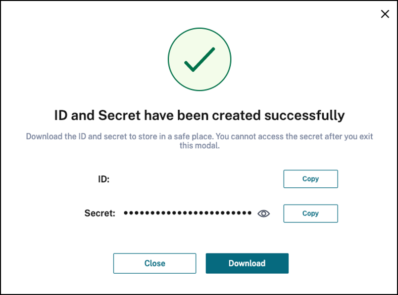

# Deploy ADM agent

Deploy container-based ADM agent to connect NetScaler CPX with ADM Service for management and monitoring.

# Table of Contents
1. [TL; DR;](#tldr)
2. [Introduction](#introduction)
3. [Generate authentication and authorization token from Access ID and Secret to access ADM](#generatetoken)
4. [Deploy ADM agent onboarding using Helm chart](#deploy-adm-agent-using-helm-chart)
6. [Manual creating login secret for NetScaler ADM Agent](#manual-secret)
7. [Automatic login secret for NetScaler ADM Agent](#automatic-secret)
8. [Clean Up](#clean-up)
9. [Configuration Parameters](#configuration-parameters)

# <a name="tldr">TL; DR;</a>
**A) Deploy adm-agent**

**A.1) Get Access ID and Secret to access ADM** 

For Access ID and secret see [this](#generatetoken).

**A.2) To create ADM agent login Secret, use the following command:**

	kubectl create secret generic admlogin --from-literal=username=nsroot --from-literal=password=<adm-agent-password> -n <namespace>
	
	helm repo add netscaler https://netscaler.github.io/netscaler-helm-charts
	helm install agent netscaler/adm-agent --namespace <namespace>
	
**Note:** If you are deploying Netscaler CPX and ADM agent in different namespaces, please label namespace with `citrix-cpx=enabled` in which Netscaler CPX has been deployed and agent will take care of creating admlogin secret in other namespaces. For more information, see [Create Secret automatically](#automatic-secret). 

# <a name="introduction">Introduction</a>

NetScaler provides a container based ADM agent to connect NetScaler CPX with ADM service for management and monitoring of NetScaler CPX.

# Prerequisites

- Ensure that you have a NetScaler ADM account. To use ADM, you must create a [Cloud account](https://docs.citrix.com/en-us/citrix-cloud/overview/signing-up-for-citrix-cloud/signing-up-for-citrix-cloud). To manage ADM with an Express account, see [Getting Started](https://docs.citrix.com/en-us/citrix-application-delivery-management-service/getting-started.html#install-an-agent-as-a-microservice).

- Ensure that you installed Kubernetes version 1.16 or later. For more information about Kubernetes installation, see [Kubernetes](https://kubernetes.io/).

- Ensure that you have installed Helm version 3.x. For information about Helm chart installation, see [Helm](https://github.com/netscaler/netscaler-helm-charts/blob/master/Helm_Installation_version_3.md).

- Ensure that the ports described in the [Ports](https://docs.citrix.com/en-us/citrix-application-delivery-management-service/system-requirements.html#ports) document are open.

- Ensure that serviceaccount adm-agent-serviceaccount is given privilege access. For more infomration, please see [this](#serviceaccount)
## <a name="generatetoken">**Get Access ID and Secret**</a> 

Perform the following steps to get access ID and secret for accessing ADM:

1. Log in to NetScaler ADM Service account. 

2. On the left Menu panel, select **Identity and Access Management**.

   

3. Go to **API Access**.

    

4. Specify the client name and click **Create Client**.

    

5. Download and save the `access-id` and `access-secret` generated.

    

# <a name="deploy-adm-agent-using-helm-chart">Deploy ADM agent using the Helm chart</a>

Before deploying the ADM agent, you must create a Kubernetes Secret containing the access ID and Secret to access ADM. For information about getting the access ID and secret for accessing  ADM, see [Access ID and Secret to access ADM](#generatetoken). After the Secret has been created, use the following commands to deploy ADM Agent:

	helm repo add netscaler https://netscaler.github.io/netscaler-helm-charts

	helm install agent netscaler/adm-agent --namespace <namespace>  

It deploys ADM Agent and registers with ADM service. It also deploys a sidecar along with ADM Agent which can create a Kubernetes Secret containing login credentials of ADM Agent automatically when namespace is labelled with `citrix-cpx=enabled`, more detail [here](#automatic-secret).

#  <a name="manual-secret">Create login secret manually for NetScaler ADM agent</a>

ADM agent login credentials are required by NetScaler CPX while registering itself to ADM Service. You can create it manually on all the namespaces in which Netscaler CPX will be deployed and also on the namespace in which the ADM agent will be created.

	kubectl create secret generic admlogin --from-literal=username=nsroot --from-literal=password=<adm-agent-password> -n <namespace> 

After the Secret has been created, you can deploy the ADM agent using the following command:

	helm install agent netscaler/adm-agent --namespace <namespace>

# <a name="automatic-secret"> Automatic login secret for NetScaler ADM agent</a>

ADM agent can create the secret for ADM agent and deploys a sidecar along with the ADM agent that creates the secret automatically whenever a namespace is labelled with `citrix-cpx=enabled`.

To label a namespace, use the following command:

	kubectl label namespace <namespace> citrix-cpx=enabled

# <a name="clean-up">Clean up</a>

To delete the resources created during the deployment of ADM agent `adm-agent` with the release name `agent`, use the following command:

	helm uninstall agent -n <namespace>

**NOTE** While removing Agent, it removes CPX & cluster registered with Agent from ADM Service. You need remove the Cluster and Agent from NetScaler ADM UI manually in case any error happen.

# <a name="serviceaccount">ServiceAccount</a>

To provide privileged permissions to the service account used by ADM Agent, please use following command

	oc adm policy add-scc-to-user privileged system:serviceaccount:<namespace>:adm-agent-serviceaccount

# <a name="configuration-parameters">Configuration parameters</a>

The following table provides the configurable parameters and their default values in the Helm chart.

| Parameter                      | Description                   | Default                   |
|--------------------------------|-------------------------------|---------------------------|
| `imageRegistry`			   | Image registry of the ADM agent onboarding container               | `quay.io`               |
| `imageRepository`			   | Image repository of the ADM agent onboarding container               | `citrix/adm-agent`               |
| `imageTag`			   | Image tag  of the ADM agent container               | `141.16.37`               |
| `pullPolicy`   | Specifies the image pull policy for ADM agent. | IfNotPresent        |
| `accessSecret`| Specifies the ID and Secret to access ADM Service.| Nil|
| `loginSecret`| Specifies the login Secret of NetScaler ADM agent.| Nil|
| `clusterPrefix`| Kubernetes/Openshift Cluster Prefix. This will be used while registering cluster to ADM.| Nil|
| `helper.helperImageRegistry`			   | Image registry of NetScaler ADM agent helper               | `quay.io`               |
| `helper.helperImageRepository`			   | Image repository of NetScaler ADM agent helper               | `citrix/adm-agent-helper`               |
| `helper.helperImageTag`			   | Image tag of NetScaler ADM agent helper               | `2.0.0`               |
| `helper.pullPolicy`   | Specifies the image pull policy for ADM agent Helper. | IfNotPresent        |

**Note:** You can use the `values.yaml` file packaged in the chart. This file contains the default configuration values for the chart.
