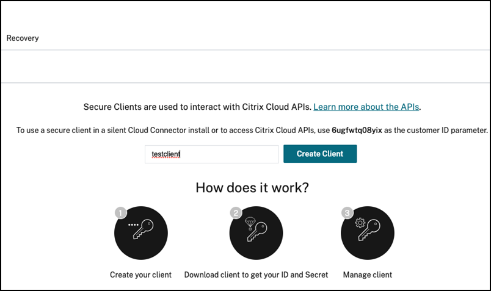

# Deploy ADM agent onboarding as Kubernetes Job

[Kubernetes job](https://kubernetes.io/docs/concepts/workloads/controllers/job/) is an object that creates one or more pods and tracks the operations of pods. Kubernetes Jobs ensure that the specified number of pods are accomplished effectively. The job is considered complete when a specified number of successful run of pods is complete. 

You can deploy ADM agent onboarding as a Kubernetes Job helps you to deploy container-based NetScaler ADM agent and also performs all the necessary settings in NetScaler ADM for generating service graph.

# Table of Contents
1. [TL; DR;](#tldr)
2. [Introduction](#introduction)
3. [Generate authentication and authorization token from Access ID and Secret to access NetScaler ADM](#generatetoken)
4. [Deploy ADM agent onboarding using Helm chart](#deploy-adm-agent-onboarding-using-helm-chart)
5. [Deploy ADM agent onboarding using Helm chart and register NetScaler VPX/MPX in NetScaler ADM](#register-adc)
6. [Manual creating login secret for NetScaler ADM Agent](#manual-secret)
7. [Automatic login secret for NetScaler ADM Agent](#automatic-secret)
8. [Clean Up](#clean-up)
9. [Configuration Parameters](#configuration-parameters)

# <a name="tldr">TL; DR;</a>

**A) Deploy adm-agent-onboarding Kubernetes job**

**A.1) Generate authentication and authorization token from Access ID and Secret to access NetScaler ADM** 

To generate the authentication and authorization bearer token using Access ID and secret see [this](#generatetoken).

**A.2) To create ADM Agent login Secret automatically, use the following command:**

	helm repo add netscaler https://netscaler.github.io/netscaler-helm-charts
	helm install netscaler-adm netscaler/citrix-cloud-native --namespace <namespace>	--set ao.enabled=true --set ao.token=<Token>

**Note:** If you are deploying NetScaler CPX and NetScaler ADM agent in different namespaces, please label namespace with `citrix-cpx=enabled` in which NetScaler CPX has been deployed. For more information, see [Create Secret automatically](#automatic-secret).

**A.2) To create NetScaler ADM agent login Secret manually, use the following command:**

	kubectl create secret generic admlogin --from-literal=username=nsroot --from-literal=password=<adm-agent-password> -n <namespace>
	
	helm repo add netscaler https://netscaler.github.io/netscaler-helm-charts
	helm install netscaler-adm netscaler/citrix-cloud-native --namespace <namespace>	--set ao.enabled=true --set ao.admAgent.loginSecret=admlogin --set ao.token=<Token>
	
**Note:** You must create `admlogin` in all the namespaces in which NetScaler CPX is deployed. 

**A.2) To create ADM Agent login Secret automatically and register NetScaler VPX/MPX in ADM, use the following command:**

	kubectl create secret generic nslogin  --from-literal=username=<NetScaler Username> --from-literal=password=<NetScaler password> -n <namespace>

	helm repo add netscaler https://netscaler.github.io/netscaler-helm-charts
	helm install netscaler-adm netscaler/citrix-cloud-native --namespace <namespace>	--set ao.enabled=true --set ao.adc.IP=<NetScaler ManagementIP>,ao.adc.loginSecret=nslogin --set ao.token=<Token>

**Note:** If you are deploying NetScaler CPX and NetScaler ADM agent in different namespaces, please label namespace with `citrix-cpx=enabled` in which NetScaler CPX has been deployed. For more information, see [Create Secret automatically](#automatic-secret). `nslogin` is Kubernetes secret for credential of NetScaler VPX/MPX. Use the Management IP for `ao.adc.IP` argument.

**A.2) To create ADM Agent login Secret automatically and register NetScaler VPX/MPX in ADM, use the following command:**

	kubectl create secret generic nslogin  --from-literal=username=<NetScaler Username> --from-literal=password=<NetScaler password> -n <namespace>

	kubectl create secret generic admlogin --from-literal=username=nsroot --from-literal=password=<adm-agent-password> -n <namespace>
	
	helm repo add netscaler https://netscaler.github.io/netscaler-helm-charts
	helm install netscaler-adm netscaler/citrix-cloud-native --namespace <namespace>	--set ao.enabled=true --set ao.admAgent.loginSecret=admlogin --set ao.adc.IP=<NetScaler ManagementIP>,ao.adc.loginSecret=nslogin --set ao.token=<Token>

**Note:** You must create `admlogin` in all the namespaces in which NetScaler CPX will be deployed. `nslogin` is Kubernetes secret for credential of NetScaler VPX/MPX. Use the Management IP for `ao.adc.IP` argument.

# <a name="introduction">Introduction</a>

NetScaler provides a Kubernetes Job known as ADM agent onboarding to simplify the container-based NetScaler ADM agent deployment and ADM settings configurations required for generating service graph. This Kubernetes Job automatically downloads the YAML file required for the NetScaler ADM agent, deploys it, and registers the cluster in NetScaler ADM.

For example to generate Service Graph with SMLite, see [Service graph example](../examples/servicegraph). For example to generate Service Graph of NetScaler intergration with Istio Service Mesh, see [Service graph with NetScaler Observability and ADM](../examples/servicegraph_with_coe_and_adm).

# Prerequisites

 - Ensure that you have a NetScaler ADM account. To use NetScaler ADM, you must create a [NetScaler Cloud account](https://docs.citrix.com/en-us/citrix-cloud/overview/signing-up-for-citrix-cloud/signing-up-for-citrix-cloud). To manage NetScaler ADM with an Express account, see [Getting Started](https://docs.citrix.com/en-us/citrix-application-delivery-management-service/getting-started.html#install-an-agent-as-a-microservice).

- Ensure that you  installed Kubernetes version 1.16 or later. For more information about Kubernetes installation, see [Kubernetes](https://kubernetes.io/).

- Ensure that you have installed Helm version 3.x. For information about Helm chart installation, see [Helm](https://github.com/netscaler/netscaler-helm-charts/blob/master/Helm_Installation_version_3.md).

 - Ensure that the ports described in the [Ports](https://docs.citrix.com/en-us/citrix-application-delivery-management-service/system-requirements.html#ports) document are open.

- For registering NetScaler VPX or MPX in NetScaler ADM using ADM agent onboarding, you should establish the connectivity between NetScaler VPX or MPX and cluster nodes. This connectivity can be established by configuring routes on NetScaler as described [here](https://github.com/netscaler/netscaler-k8s-ingress-controller/blob/master/docs/network/staticrouting.md) or by deploying [NetScaler Node Controller](https://github.com/netscaler/netscaler-k8s-node-controller).

## <a name="generatetoken">**Generate Authentication and Authorization Token from Access ID and Secret**</a> 

Perform the following steps to get access ID and secret for accessing NetScaler ADM:

1. Log in to NetScaler Cloud account. 

2. On the left Menu panel, select **Identity and Access Management**.

   

3. Go to **API Access**.

    

4. Specify the client name and click **Create Client**.

    

5. Download and save the `access-id` and `access-secret` generated.

    

 Now, you can generate `authorization bearer token` using access ID and access secret using below script: 

	wget  https://raw.githubusercontent.com/netscaler/netscaler-helm-charts/master/generate_token.py
	
	python3 generate_token.py --accessID=<accessID> --accessSecret=<accessSecret>

**NOTE**: The bearer token expires in an hour (3600 seconds).

# <a name="deploy-adm-agent-onboarding-using-helm-chart">Deploy ADM agent onboarding using the Helm chart</a>

Before deploying the ADM agent onboarding, you must create a Kubernetes Secret containing the client ID and Secret to access NetScaler ADM. For information about getting the access ID and secret for accessing NetScaler ADM, see [Access ID and Secret to access NetScaler ADM](#generatetoken). After the Secret has been created, use the following commands to deploy NetScaler ADM Agent:

	helm repo add netscaler https://netscaler.github.io/netscaler-helm-charts

	helm install netscaler-adm netscaler/citrix-cloud-native --namespace <namespace> --set ao.enabled=true --set ao.token=<Token>     

It deploys the Kubernetes Job that deploys NetScaler ADM Agent and registers the cluster on the NetScaler ADM. it also performs the other settings required for servicegraph in NetScaler ADM. It also deploys a sidecar along with NetScaler ADM Agent which can create a Kubernetes Secret containing login credentials of NetScaler ADM Agent automatically when namespace is labelled with `citrix-cpx=enabled`, more detail [here](#automatic-secret).

**Note:** If you do not want to run a sidecar, see [Create Secret manually for NetScaler agent](#manual-secret).

#  <a name="register-adc">Deploy ADM agent onboarding and register NetScaler VPX/MPX with NetScaler ADM</a>

**Important Note:** For registering NetScaler VPX/MPX in NetScaler ADM, you should establish the connectivity between NetScaler VPX or MPX and cluster nodes. This connectivity can be established by configuring routes on NetScaler as described in the document: [Static route on Ingress NetScaler](https://github.com/netscaler/netscaler-k8s-ingress-controller/blob/master/docs/network/staticrouting.md) or by deploying [NetScaler node controller](https://github.com/netscaler/netscaler-k8s-node-controller).

To register NetScaler VPX/MPX with NetScaler ADM, create a Kubernetes secret containing login credentials of NetScaler VPX/MPX in the namespace in which ADM agent onboarding Job will be functional. Use the following command:

	kubectl create secret generic nslogin --from-literal=username=<username> --from-literal=password=<netscaler-password> -n <namespace>

You have to pass the management IP address of NetScaler VPX/MPX as an environment variable: `ao.adc.IP`.
	
	helm repo add netscaler https://netscaler.github.io/netscaler-helm-charts

	helm install netscaler-adm netscaler/citrix-cloud-native --namespace <namespace> --set ao.enabled=true --set ao.adc.IP=<NetScaler ManagementIP>,ao.adc.loginSecret=nslogin --set ao.token=<Token>

**Note:** Using environment variables, you can specify the management HTTP port `ao.adc.mgmtHTTPPort` and HTTPS port `ao.adc.mgmtHTTPSPort` as 80 and 443 respectively.

#  <a name="manual-secret">Create login secret manually for NetScaler ADM agent</a>

NetScaler ADM agent login credentials are required by NetScaler CPX while registering itself to NetScaler ADM. You can create it manually on all the namespaces in which NetScaler CPX will be deployed and also on the namespace in which the NetScaler ADM agent Adaptor Kubernetes job will be created.

	kubectl create secret generic admlogin --from-literal=username=nsroot --from-literal=password=<adm-agent-password> -n <namespace>

After the Secret has been created, you can deploy the NetScaler ADM agent using the following command:

	helm install netscaler-adm netscaler/citrix-cloud-native --namespace <namespace> --set ao.enabled=true --set ao.admAgent.loginSecret=admlogin --set ao.token=<Token>

# <a name="automatic-secret"> Automatic login secret for NetScaler ADM agent</a>

NetScaler ADM agent can create the secret for NetScaler ADM agent and deploys a sidecar along with the NetScaler ADM agent that creates the secret automatically whenever a namespace is labelled with `citrix-cpx=enabled`.

To label a namespace, use the following command:

	kubectl label namespace <namespace> citrix-cpx=enabled

# <a name="clean-up">Clean up</a>

To delete the resources created during the deployment of ADM agent onboarding `adm-agent-onboarding` with the release name  `netscaler.adm`, use the following command:

	helm delete netscaler-adm -n <namespace>

To delete NetScaler ADM Agent pods and other resources use the following commands:

	kubectl delete deployment admagent -n <namespace>
	kubectl delete secret admagent -n <namespace>
	kubectl delete configmaps admagent -n <namespace>
	kubectl delete svc admagent -n <namespace>
	kubectl delete secret admlogin -n <namespace>
    kubectl delete secret nslogin -n <namespace>
    kubectl delete sa admagent -n <namespace>
    kubectl delete clusterroles admagent -n <namespace>
    kubectl delete clusterrolebindings admagent -n <namespace>

**NOTE** You need remove the Cluster and Agent from NetScaler ADM UI manually.

# <a name="configuration-parameters">Configuration parameters</a>

The following table provides the configurable parameters and their default values in the Helm chart.

| Parameter                      | Description                   | Default                   |
|--------------------------------|-------------------------------|---------------------------|
| `ao.imageRegistry`			   | Image registry of the ADM agent onboarding container               | `quay.io`               |
| `ao.imageRepository`			   | Image repository of the ADM agent onboarding container               | `citrix/adm-agent-onboarding`               |
| `ao.imageTag`			   | Image tag  of the ADM agent onboarding container               | `1.1.0`               |
| `ao.pullPolicy`   | Image pull policy for NetScaler ADM-adaptor | IfNotPresent        |
| `ao.token`     | Authentication and authorization bearer token generated using access ID and access secret.  | nil                     |
| `ao.apiURL`     | Provide Kubernetes API URL in `https://<host>:port` format  | nil |
| `ao.clusterName`     | Kubernetes cluster name to be registered in ADM Service.  | nil |
|`ao.admAgent.name`|  Name for the ADM Agent.| "admagent" |
|`ao.admAgent.imageRegistry`			   | Image registry of the NetScaler ADM agent               | `quay.io`               |
|`ao.admAgent.imageRepository`			   | Image repository of the NetScaler ADM agent               | `citrix/adm-agent`               |
|`ao.admAgent.imageTag`			   | Image tag  of the NetScaler ADM agent               | `latest`               |
|`ao.admAgent.helperImageRegistry`			   | Image registry of NetScaler ADM agent helper               | `quay.io`               |
|`ao.admAgent.helperImageRepository`			   | Image repository of NetScaler ADM agent helper               | `citrix/adm-agent-helper`               |
|`ao.admAgent.helperImageTag`			   | Image tag of NetScaler ADM agent helper               | `1.0.0`               |
|`ao.admAgent.loginSecret`|Specifies the login Secret of NetScaler ADM agent.| Nil|
|`ao.adc.IP`| Specifies the NetScaler VPX/MPS management IP address.| Nil |
|`ao.adc.mgmtHTTPPort`| Specifies the NetScaler VPX/MPX management HTTP port.| 80 |
|`ao.adc.mgmtHTTPSPort`|Specifies the NetScaler VPX/MPX management HTTPS port.| 443|
|`ao.adc.loginSecret`| Specifies the the Kubernetes secret containing NetScaler VPX/MPX login credentials. | nslogin|

**Note:** You can use the `values.yaml` file packaged in the chart. This file contains the default configuration values for the chart.
