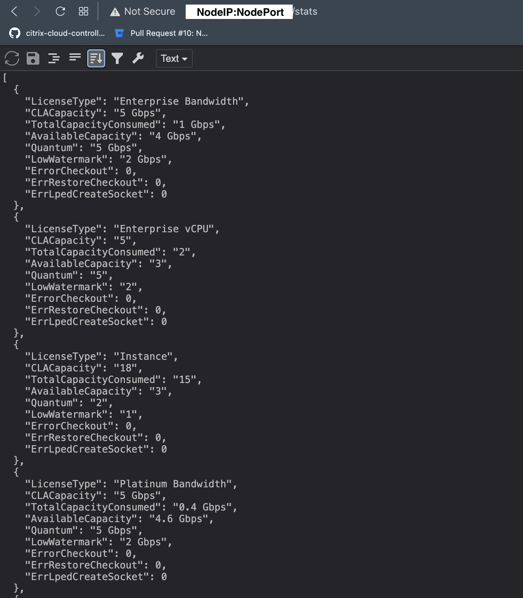

# NetScaler CPX License Aggregator: Sample deployment

NetScaler CPX License Aggregator licenses NetScaler CPXs deployed in the Kubernetes environment. NetScaler CPX License Aggregator handles all deployment modes (standalone or sidecar) of NetScaler CPX. This guide demonstrates an example of NetScaler CPX License Aggregator licensing both standalone and sidecar CPXs **instance**s.

## Table of Contents
1. [Deploying NetScaler CPX License Aggregator](#deploying-cla)
2. [Deploying Standalone NetScaler CPX](#cpx-with-cic)
3. [Deploying Sidecar NetScaler CPX](#cpx-servicemesh)
4. [Verification](#verification)
5. [Clean Up](#cleanup)

## Sample Topology

NetScaler CPX License Aggregator acts as a license proxy. It checks out licenses in bulk from the NetScaler ADM license server and provides instance licenses to each NetScaler CPX running in the Kubernetes cluster.


### Prerequisites

- The [Kubernetes](https://kubernetes.io/) version should be 1.16 and above.
- The [Helm](https://helm.sh/) version 3.x or later. You can follow instruction given [here](https://github.com/netscaler/netscaler-helm-charts/blob/master/Helm_Installation_version_3.md) to install the same.
- Ensure that **Istio version 1.8 onwards** is installed to create sidecar CPX instances. Follow [this](https://istio.io/latest/docs/setup/getting-started/#download) installation guide for the same.
- You need to provide password that will be used for the Redis DB in CLA. You can provide DB password using Kubernetes secret in the same namespace of NetScaler CPX License Aggregator and following command can be used to create the secret:

    kubectl create secret generic dbsecret --from-literal=password=*myPassword* -n netscaler-system

# <a name="deploying-cla">1. Deploying NetScaler CPX License Aggregator </a>

Provide the IP address or FQDN of the NetScaler ADM License Server in the helm variable `licenseServer.address`. In case of ADM service, please provide the details of NetScaler ADM Agent.

   ```
   kubectl create namespace netscaler-system

   helm repo add netscaler https://netscaler.github.io/netscaler-helm-charts/

   helm install cla netscaler/cpx-license-aggregator --namespace netscaler-system --set licenseServer.address=<ADM-License-Server-IP or ADM-agent-FQDN>,licenseServer.port=27000,redis.secretName=<Kubernetes-Secret-containing-DB-credentials> --set licenseAggregator.username=<myname> --set licenseInfo.instanceQuantum=18,licenseInfo.instanceLowWatermark=1 --set licenseInfo.bandwidthEnterpriseQuantum=5000,licenseInfo.bandwidthEnterpriseLowWatermark=2000 --set licenseInfo.vcpuEnterpriseQuantum=5,licenseInfo.vcpuEnterpriseLowWatermark=2
   ```
In the above command, username represents the handler of license aggregator. In the ADM license server, the details of this instance of CPX License Aggregator would be associated with the provided username.

## Bandwidth Pool Licensing

NetScaler CPX licenses can be allocated based on the bandwidth consumption by the instances. By default, when the NetScaler CPX instance is licensed, it is unlocked with 1 Gbps throughput capacity. These CPX instances are allotted licenses from the `instance` quota of the NetScaler CPX License Aggregator. 

If the NetScaler CPX instance needs to be allotted with more than 1 Gbps bandwidth, then CPX needs to provide additional bandwidth requirement in the registration request (apart from the instance check-out request) to the NetScaler CPX License Aggregator. This additional bandwidth is allotted from the Bandwidth quota present with the NetScaler CPX License Aggregator.


In the above command,

1) `licenseInfo.instanceQuantum` represents the amount of instance licenses to be checked-out in bulk from NetScaler ADM License Server when 

    * License Aggregator boots up.

    * The available licenses fall below `licenseInfo.instanceLowWatermark` value.


2) `licenseInfo.bandwidthEnterpriseQuantum` represents the total Enterprise bandwidth checked-out in **Mbps** by the CLA from License Server, and when the available/free capacity of the CLA falls below `licenseInfo.bandwidthEnterpriseLowWatermark` value, additional `bandwidthEnterpriseQuantum` will be checked-out again. 

In the given example, 5 Gbps (5000 Mbps) enterprise bandwidth will be checked-out by the CLA. When the CLA allots 3 Gbps to the NetScaler CPX instances, additional 5 Gbps will be checked-out.

## vCPU Pool Licensing
In the virtual CPU-usage-based licensing, the license specifies the number of CPUs that a particular NetScaler CPX instance is entitled to. So, the NetScaler CPX can check out licenses for only the number of virtual CPUs from the NetScaler CPX License Aggregator.

**Enterprise vCPU Licensing**
`licenseInfo.vcpuEnterpriseQuantum` represents the total Enterprise vCPUs quota checked-out by the CLA from License Server, and when the available/free capacity of the CLA falls below `licenseInfo.vcpuEnterpriseLowWatermark` value, additional `vcpuEnterpriseQuantum` will be checked-out again. 

In the above command, 5 vCPUs of enterprise category will be checked-out by the CLA. When the CLA has only 3 vCPUs available, it'll check-out 5 more vCPUs proactively.

For more details about the NetScaler CPX licensing, read [this](https://docs.netscaler.com/en-us/citrix-adc-cpx//current-release/cpx-licensing.html) guide.

# <a name="cpx-with-cic">2. Deploying Standalone NetScaler CPX </a>
Standalone NetScaler CPX can be any CPX that doesn't run as a sidecar in the pod along with application container.

NetScaler CPXs acting as Ingress or gateway devices are standalone instances.

In this example guide, two standalone NetScaler CPXs are installed: 

i) NetScaler CPX as Kubernetes Ingress with NSIC

ii) NetScaler CPX as Istio Ingress Gateway


##  i) NetScaler CPX as Kubernetes Ingress with NSIC   

    helm install cpx-with-ingress-controller citrix/citrix-cpx-with-ingress-controller --namespace netscaler-system --set license.accept=yes,crds.install=true --set cpxLicenseAggregator=cla-cpx-license-aggregator.netscaler-system --set ADMSettings.vCPULicense=true,ADMSettings.cpxCores=2,ADMSettings.licenseEdition=enterprise
    
The given command will fetch Enterprise category licenses with below capability
* 2 vCPUs - Instantiating CPX with 2 Packet Engines (PEs)

##  ii) NetScaler CPX as Istio Ingress Gateway
    
    helm install citrix-adc-istio-ingress-gateway netscaler/citrix-adc-istio-ingress-gateway --namespace netscaler-system --set ingressGateway.EULA=true --set citrixCPX=true --set ingressGateway.cpxLicenseAggregator=cla-cpx-license-aggregator.netscaler-system --set ADMSettings.bandWidthLicense=true,ADMSettings.bandWidth=2000,ADMSettings.licenseEdition=enterprise
    
The given command will fetch Enterprise category licenses with below capabilities
* instance license (in-built with 1 Gbps throughput capacity)
* additional 1 Gbps capacity (total 2 Gbps throughput capacity of the CPX)

*Note*: Ensure Istio servicemesh is installed to deploy NetScaler CPX as Istio Ingress Gateway.

# <a name="cpx-servicemesh">3. Deploying Sidecar NetScaler CPX </a>

### A. Deploying NetScaler CPX Sidecar Injector

The below command deploys the CPX sidecar injector webhook that is responsible to inject NetScaler CPX as a sidecar in the application pod.
For more details about the NetScaler CPX sidecar injector, follow [this](https://github.com/netscaler/netscaler-helm-charts/tree/master/citrix-cpx-istio-sidecar-injector) link.

    
    helm install cpx-sidecar-injector netscaler/citrix-cpx-istio-sidecar-injector --namespace netscaler-system --set cpxProxy.EULA=YES --set ADMSettings.bandWidthLicense=true,ADMSettings.licenseEdition=enterprise --set cpxProxy.cpxLicenseAggregator=cla-cpx-license-aggregator.netscaler-system
    
### B. Deploy a sample application

1. Create application namespace and enable it for sidecar CPX injection.
    ```
    kubectl create namespace httpbin
    kubectl label namespace httpbin cpx-injection=enabled 
    ```
    

2. Deploy Httpbin application.
    ```
    kubectl apply -n httpbin -f https://raw.githubusercontent.com/citrix/citrix-helm-charts/master/examples/servicemesh_with_coe_and_adm/manifest/httpbin.yaml
    ```
    

Once the httpbin pod is running, you should see NetScaler CPX and [NetScaler xDS-Adaptor](https://github.com/netscaler/netscaler-xds-adaptor) as sidecars in the same.

For more details about creating additional httpbin resources and to generate traffic, follow [this](https://github.com/netscaler/netscaler-helm-charts/tree/master/examples/servicemesh_with_coe_and_adm#deploying-bookinfo-httpbin) guide.


# <a name="verification">4. Verification </a>

## A. Verification on NetScaler CPX License Aggregator

NetScaler CPX License Aggregator provides couple of URLs to give licensing related insights. 

i) `/stats` URL path provides brief info about total number of licenses NetScaler CPX License Aggregator holds, and how many NetScaler CPXs are currently licensed by the license aggregator service.

ii) `/cpxinfo` URL path gives a list of NetScaler CPXs licensed by the license aggregator service. HTTP request to this URL must contain HTTP header named `x-cla` with value `1.0.0`.

If NetScaler CPX License Aggregator is exposed to the client using NodePort, then use `kubectl get service` command to identify the nodeport being used for License Aggregator service. Visit below URLs from your browser or using a cURL utility.

### Check the License Aggregator status
Send HTTP request to `/stats` path.

```https://<NodeIP:Nodeport>/stats```

Below is the snapshot of JSON output of stats. It represents that the NetScaler CPX License Aggregator 

* Holds 5 Gbps Enterprise Bandwidth capacity out of which 1 Gbps has been given to the NetScaler CPXs, and it can serve the need up to 4 Gbps.

* Owns Enterprise vCPU license and can allot total 5 vCPUs to CPXs. Right now, 2 vCPUs are already allotted and 3 more vCPU requests can be successfully handled.

* Owns 18 licenses of type INSTANCE and total 15 NetScaler CPX instances are licensed by the License Aggregator.




### Check the details of licensed NetScaler CPXs
Send HTTP request with custom header to `/cpxinfo` path.

```curl -H "x-cla: 1.0.0" https://<NodeIP:Nodeport>/cpxinfo```

Below snapshot captures the sample output of above cpxinfo request. Please note the presence of `sidecar` field alongwith `licenseInfo` details.


## B. Verification on NetScaler CPX
Alternatively, licensing status of a particular NetScaler CPX can also be verified from the NetScaler CPX console itself.

1. Login to the cluster hosting NetScaler CPX.
2. Fire below command.
    ```
    kubectl exec -it -n netscaler-system -c <cpx-pod-name> <podname> -- bash
    ```

    Once inside the CPX pod, fire below commands to see license status.

    ```
    ./cli_script.sh "show ns capacity"
    ./cli_script.sh "show ns license"
    ./cli_script.sh "show ns licenseserver"
    ```

The sample output of above commands is shown below.
    
    > show ns capacity
            Minimum Bandwidth             : 20 Mbps
            Maximum Bandwidth             : 40 Gbps
            Configured Bandwidth          : 1000 Mbps
            Actual Bandwidth              : 1000 Mbps
            Edition                       : Platinum
    Done
    

The last few lines of "show ns license" output.

    
    Model Number ID: 1000
    License Type: Platinum License
    Licensing mode: Pooled
    Days to expiration: 0
    

The output of "show ns licenseserver" command.

    > show ns licenseserver
            License Server: cla-cpx-license-aggregator.netscaler-system         Port: 0               Status: Disconnected                      Type: CLA
    Done
    

# <a name="cleanup">5. Clean Up </a>

1. Uninstall httpbin application 
    ```
    kubectl delete -n httpbin -f https://raw.githubusercontent.com/citrix/citrix-helm-charts/master/examples/servicemesh_with_coe_and_adm/manifest/httpbin.yaml
    ```
    Or delete the namespace altogether.
    ```
    kubectl delete ns httpbin
    ```

2. Uninstall CPX sidecar injector.
    ```
    helm delete cpx-sidecar-injector -n netscaler-system
    ```

3. Uninstall standalone NetScaler CPXs.

    ```
    helm delete cpx-with-ingress-controller --namespace netscaler-system

    helm delete citrix-adc-istio-ingress-gateway --namespace netscaler-system 
    ```

4. Uninstall NetScaler CPX License Aggregator.

    ```
    helm delete cla --namespace netscaler-system

    kubectl delete pvc data-cla-cpx-license-aggregator-0 -n netscaler-system

    kubectl delete secret generic dbsecret -n netscaler-system
    ```

*Note*: Instead of steps 2 to 4 mentioned above, `netscaler-system` namespace can also be deleted to remove all NetScaler services mentioned in this guide.
