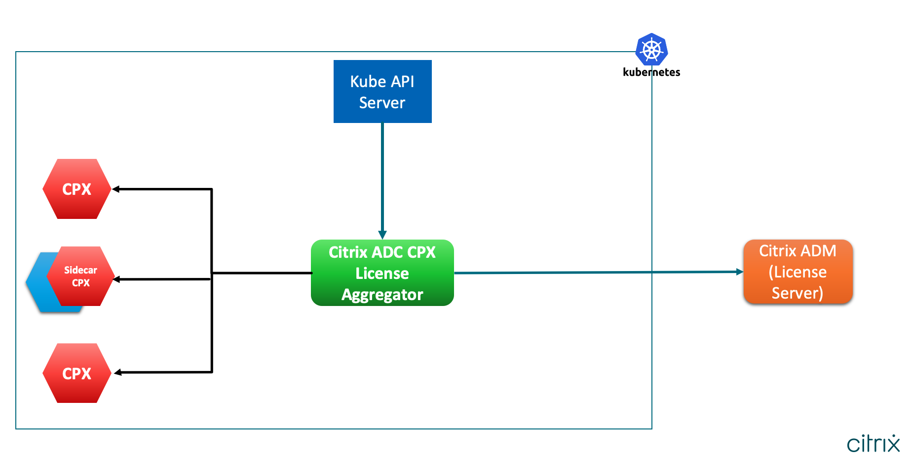
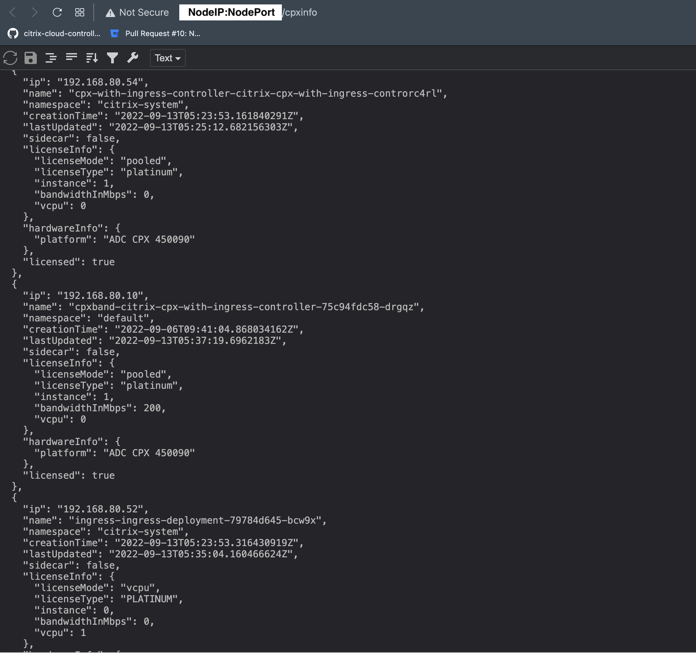

# Citrix ADC CPX License Aggregator: Sample deployment

Citrix ADC CPX License Aggregator licenses Citrix ADC CPXs deployed in the Kubernetes environment. Citrix ADC CPX License Aggregator handles all deployment modes (standalone or sidecar) of Citrix ADC CPX. This guide demonstrates an example of Citrix ADC CPX License Aggregator licensing both standalone and sidecar CPXs **instance**s.

## Table of Contents
1. [Deploying Citrix ADC CPX License Aggregator](#deploying-cla)
2. [Deploying Standalone Citrix ADC CPX](#cpx-with-cic)
3. [Deploying Sidecar Citrix ADC CPX](#cpx-servicemesh)
4. [Verification](#verification)
5. [Clean Up](#cleanup)

## Sample Topology

Citrix ADC CPX License Aggregator acts as a license proxy. It checks out licenses in bulk from the Citrix ADM license server and provides instance licenses to each Citrix ADC CPX running in the Kubernetes cluster.



### Prerequisites

- The [Kubernetes](https://kubernetes.io/) version should be 1.16 and above.
- The [Helm](https://helm.sh/) version 3.x or later. You can follow instruction given [here](https://github.com/citrix/citrix-helm-charts/blob/master/Helm_Installation_version_3.md) to install the same.
- Ensure that **Istio version 1.8 onwards** is installed to create sidecar CPX instances. Follow [this](https://istio.io/latest/docs/setup/getting-started/#download) installation guide for the same.
- You need to provide password that will be used for the Redis DB in CLA. You can provide DB password using Kubernetes secret in the same namespace of Citrix ADC CPX License Aggregator and following command can be used to create the secret:

    kubectl create secret generic dbsecret --from-literal=password=*myPassword* -n citrix-system

# <a name="deploying-cla">1. Deploying Citrix ADC CPX License Aggregator </a>

Provide the IP address or FQDN of the Citrix ADM License Server in the helm variable `licenseServer.address`. In case of ADM service, please provide the details of Citrix ADM Agent.

   ```
   kubectl create namespace citrix-system

   helm repo add citrix https://citrix.github.io/citrix-helm-charts/

   helm install cla citrix/cpx-license-aggregator --namespace citrix-system --set licenseServer.address=<ADM-License-Server-IP or ADM-agent-FQDN>,licenseServer.port=27000,redis.secretName=<Kubernetes-Secret-containing-DB-credentials> --set licenseAggregator.username=<myname> --set licenseInfo.quantum=5,licenseInfo.lowWatermark=2
   ```
In the above command, username represents the handler of license aggregator. In the ADM license server, the details of this instance of CPX License Aggregator would be associated with the provided username.

`licenseInfo.quantum` represents the amount of licenses to be checked-out in bulk from Citrix ADM License Server when 

i) License Aggregator boots up.

ii) The available licenses fall below `licenseInfo.lowWatermark` value.

# <a name="cpx-with-cic">2. Deploying Standalone Citrix ADC CPX </a>
Standalone Citrix ADC CPX can be any CPX that doesn't run as a sidecar in the pod along with application container.

Citrix ADC CPXs acting as Ingress or gateway devices are standalone instances.

In this example guide, two standalone Citrix ADC CPXs are installed: 

i) Citrix ADC CPX as Kubernetes Ingress with CIC

ii) Citrix ADC CPX as Istio Ingress Gateway


##  i) Citrix ADC CPX as Kubernetes Ingress with CIC   

    helm install cpx-with-ingress-controller citrix/citrix-cpx-with-ingress-controller --namespace citrix-system --set license.accept=yes,crds.install=true --set ADMSettings.bandWidthLicense=true --set cpxLicenseAggregator=cla-cpx-license-aggregator.citrix-system
    

##  ii) Citrix ADC CPX as Istio Ingress Gateway
    
    helm install citrix-adc-istio-ingress-gateway citrix/citrix-adc-istio-ingress-gateway --namespace citrix-system --set ingressGateway.EULA=true --set citrixCPX=true --set ingressGateway.cpxLicenseAggregator=cla-cpx-license-aggregator.citrix-system --set ADMSettings.bandWidthLicense=true 
    

*Note*: Ensure Istio servicemesh is installed to deploy Citrix ADC CPX as Istio Ingress Gateway.

# <a name="cpx-servicemesh">3. Deploying Sidecar Citrix ADC CPX </a>

### A. Deploying Citrix ADC CPX Sidecar Injector

The below command deploys the CPX sidecar injector webhook that is responsible to inject Citrix ADC CPX as a sidecar in the application pod.
For more details about the Citrix ADC CPX sidecar injector, follow [this](https://github.com/citrix/citrix-helm-charts/tree/master/citrix-cpx-istio-sidecar-injector) link.

    
    helm install cpx-sidecar-injector citrix/citrix-cpx-istio-sidecar-injector --namespace citrix-system --set cpxProxy.EULA=YES --set ADMSettings.bandWidthLicense=true --set cpxProxy.cpxLicenseAggregator=cla-cpx-license-aggregator.citrix-system
    
### B. Deploy a sample application

1. Create application namespace and enable it for sidecar CPX injection.
    ```
    kubectl create namespace httpbin
    kubectl label namespace httpbin cpx-injection=enabled 
    ```
    

2. Deploy Httpbin application.
    ```
    kubectl apply -n httpbin -f https://raw.githubusercontent.com/citrix/citrix-helm-charts/master/examples/servicemesh_with_coe_and_adm/manifest/httpbin.yaml
    ```
    

Once the httpbin pod is running, you should see Citrix ADC CPX and [Citrix xDS-Adaptor](https://github.com/citrix/citrix-xds-adaptor) as sidecars in the same.

For more details about creating additional httpbin resources and to generate traffic, follow [this](https://github.com/citrix/citrix-helm-charts/tree/master/examples/servicemesh_with_coe_and_adm#deploying-bookinfo-httpbin) guide.


# <a name="verification">4. Verification </a>

## A. Verification on Citrix ADC CPX License Aggregator

Citrix ADC CPX License Aggregator provides couple of URLs to give licensing related insights. 

i) `/stats` URL path provides brief info about total number of licenses Citrix ADC CPX License Aggregator holds, and how many Citrix ADC CPXs are currently licensed by the license aggregator service.

ii) `/cpxinfo` URL path gives a list of Citrix ADC CPXs licensed by the license aggregator service. HTTP request to this URL must contain HTTP header named `x-cla` with value `1.0.0`.

If Citrix ADC CPX License Aggregator is exposed to the client using NodePort, then use `kubectl get service` command to identify the nodeport being used for License Aggregator service. Visit below URLs from your browser or using a cURL utility.

### Check the License Aggregator status
Send HTTP request to /stats path.

`https://<NodeIP:Nodeport>/stats`

Below is the sample JSON output of stats. It represents that Citrix ADC CPX License Aggregator owns 15 licenses of type **INSTANCE** and total 9 Citrix ADC CPX instances are licensed by the License Aggregator.

```
{
  "CurrentLicenseCapacity": 15,
  "LicenseType": "INSTANCE",
  "TotalLicensedCPXs": 9
}
```

### Check the details of licensed Citrix ADC CPXs
Send HTTP request with custom header to /cpxinfo path.

`curl -H "x-cla: 1.0.0" https://<NodeIP:Nodeport>/cpxinfo`

Below snapshot captures the sample output of above cpxinfo request. Please note the presence of `sidecar` field alongwith `licenseInfo` details.



## B. Verification on Citrix ADC CPX
Alternatively, licensing status of a particular Citrix ADC CPX can also be verified from the Citrix ADC CPX console itself.

1. Login to the cluster hosting Citrix ADC CPX.
2. Fire below command.
    ```
    kubectl exec -it -n citrix-system -c <cpx-pod-name> <podname> -- bash
    ```

    Once inside the CPX pod, fire below commands to see license status.

    ```
    ./cli_script.sh "show ns capacity"
    ./cli_script.sh "show ns license"
    ./cli_script.sh "show ns licenseserver"
    ```

The sample output of above commands is shown below.
    
    > show ns capacity
            Minimum Bandwidth             : 20 Mbps
            Maximum Bandwidth             : 40 Gbps
            Configured Bandwidth          : 1000 Mbps
            Actual Bandwidth              : 1000 Mbps
            Edition                       : Platinum
    Done
    

The last few lines of "show ns license" output.

    
    Model Number ID: 1000
    License Type: Platinum License
    Licensing mode: Pooled
    Days to expiration: 0
    

The output of "show ns licenseserver" command.

    > show ns licenseserver
            License Server: cla-cpx-license-aggregator.citrix-system         Port: 0               Status: Disconnected                      Type: CLA
    Done
    

# <a name="cleanup">5. Clean Up </a>

1. Uninstall httpbin application 
    ```
    kubectl delete -n httpbin -f https://raw.githubusercontent.com/citrix/citrix-helm-charts/master/examples/servicemesh_with_coe_and_adm/manifest/httpbin.yaml
    ```
    Or delete the namespace altogether.
    ```
    kubectl delete ns httpbin
    ```

2. Uninstall CPX sidecar injector.
    ```
    helm delete cpx-sidecar-injector -n citrix-system
    ```

3. Uninstall standalone Citrix ADC CPXs.

    ```
    helm delete cpx-with-ingress-controller --namespace citrix-system

    helm delete citrix-adc-istio-ingress-gateway --namespace citrix-system 
    ```

4. Uninstall Citrix ADC CPX License Aggregator.

    ```
    helm delete cla --namespace citrix-system

    kubectl delete pvc data-cla-cpx-license-aggregator-0 -n citrix-system

    kubectl delete secret generic dbsecret -n citrix-system
    ```

*Note*: Instead of steps 2 to 4 mentioned above, `citrix-system` namespace can also be deleted to remove all Citrix services mentioned in this guide.
