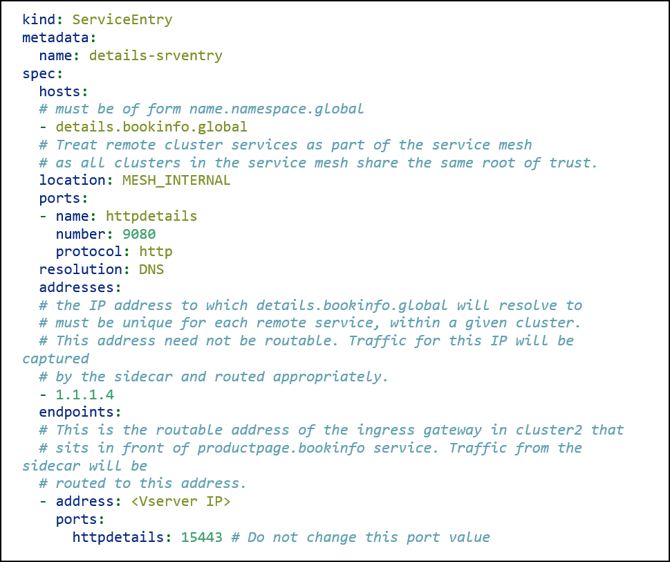

# Table of contents

1. [Citrix ADC in Istio mesh across multiple clusters](#Citrix-ADC-in-Istio-mesh-across-multiple-clusters)
2. [Deploy Citrix ADC as multi-cluster Ingress gateway](#Deploy-Citrix-ADC-as-multi-cluster-Ingress-gateway)
3. [Configure Ingress gateway for application](#Configure-Ingress-gateway-for-application)
4. [Verifying the deployments](#Verifying-the-deployments)

## <a name="Citrix-ADC-in-Istio-mesh-across-multiple-clusters">Citrix ADC in Istio mesh across multiple clusters</a>

Istio multi-cluster service mesh allows workloads which are running on multiple Kubernetes clusters to discover, dynamically route to, and securely connect with one another. You can deploy Citrix ADC form factors CPX, VPX, and/or MPX on an Istio service mesh spanning across multiple Kubernetes clusters. Citrix ADC CPX, VPX, or MPX acts as proxies to manage cluster to cluster traffic routing and security, and to provide observability for all microservices, which are running in clusters.

   

The diagram illustrates the architecture of an Istio multi-cluster service mesh with the Citrix ADC form factors CPX, VPX, and MPX as Ingress gateways. Istio multi-cluster service mesh with the Citrix ADC form factor enables multi-cluster East-West communication between services running in one cluster to services running in another cluster. Istio provides a multi-cluster service mesh to include microservices running in other clusters. Citrix ADC CPX is deployed in Cluster-1 as an Ingress gateway that routes traffic to the `productpage` pod. This pod, in Cluster-1, requires information from other microservices, named, `details` and `reviews` running in the `bookinfo` namespace of Cluster-2. The `productpage` pod sends a request in a specific format, with the DNS suffix as `.global`, to Citrix ADC VPX/MPX that has been deployed as an ingress gateway for Cluster-2. Citrix ADC VPX/MPX forwards the request to the appropriate Cluster-2 pods such as `details` and `reviews` to get the response.

**Prerequisites**

 -  Ensure that you have two or more Kubernetes clusters. For information about deploying multiple clusters, see [Multiple clusters](https://istio.io/v1.6/docs/ops/deployment/deployment-models/#multiple-clusters).
 -  Ensure that the DNS setup is complete. For information about DNS setup, see [Set up DNS](https://istio.io/v1.6/docs/setup/install/multicluster/gateways/#setup-dns).

## <a name="Deploy-Citrix-ADC-as-multi-cluster-Ingress-gateway">Deploy Citrix ADC as multi-cluster Ingress gateway</a>

You can deploy Citrix ADC as multi-cluster ingress gateway. Citrix ADC as multi-cluster gateway enables inter-cluster service to service (East-West) communication.

For information about deploying Citrix ADC CPX, VPX, or MPX as an Ingress gateway in a multi-cluster Istio Service mesh, see [Deploy Citrix ADC as an Ingress Gateway in multi cluster Istio Service mesh](https://github.com/citrix/citrix-helm-charts/tree/master/citrix-adc-istio-ingress-gateway#deploy-citrix-adc-as-a-multicluster-ingress-gateway). 

To deploy Citrix ADC as multi-cluster Ingress gateway, you can specify certain optional parameters in the Helm chart.

You can set the `ingressGateway.multiClusterIngress` parameter value as `true` if Citrix ADC acts as Ingress gateway to multi-cluster Istio mesh installation. You can also specify the port number for the parameter `ngressGateway.multiClusterListenerPort`. This is the port opened on Citrix ADC that enables inter-cluster service to service (East-West) communication. Specify the NodePort for the parameter  `ingressGateway.multiClusterListenerNodePort` as NodePort for `multiClusterListenerPort` if Citrix ADC CPX acts as Ingress gateway. You can also specify the `ingressGateway.multiClusterSvcDomain` parameter. This is the domain suffix of the remote service (deployed in the other cluster) used in East-West communication. For more information about the parameters, see [Configuration parameters](https://github.com/citrix/citrix-helm-charts/tree/master/citrix-adc-istio-ingress-gateway#configuration-parameters).

## <a name="Configure-Ingress-gateway-for-application">Configure Ingress gateway for application</a>

The following is a sample application deployment procedure that configures Ingress gateway for the `bookinfo` application that comprises microservices `productpage`, `details`, and `reviews` whereas the remaining services are deployed in Cluster-1.

Perform the following steps in Cluster-1:

 1.  Generate a private key using the following command:

          openssl genrsa -out bookinfo_key.pem 2048

 2.  Generate Certificate Signing Request (CSR) using the following command. Make sure to provide a common name (CN/server FQDN) as `www.bookinfo.com` on the CSR information prompt.

          openssl req -new -key bookinfo_key.pem -out bookinfo_csr.pem

 3.  Generate self-signed certificate using the following command:

          openssl x509 -req -in bookinfo_csr.pem -sha256 -days 365 -extensions v3_ca -signkey bookinfo_key.pem -CAcreateserial -out bookinfo_cert.pem

 4.  Create a Kubernetes secret. Create `citrix-ingressgateway-certs` secret using certificate and key generated earlier. Ensure that the secret is created in the same namespace in which the Ingress gateway is deployed. Use the following command:

          kubectl create -n citrix-system secret tls citrix-ingressgateway-certs --key bookinfo_key.pem --cert bookinfo_cert.pem

 5.  Deploy Citrix ADC CPX as Ingress gateway using the Helm chart: [Deploy Citrix ADC CPX as an Ingress Gateway](https://github.com/citrix/citrix-helm-charts/tree/master/citrix-adc-istio-ingress-gateway#to-deploy-citrix-adc-cpx-as-an-ingress-gateway).
 
 6.  Deploy `cpx-sidecar-injector` service. Perform the steps provided in the [Deploy Citrix ADC CPX as a sidecar using Helm charts](https://github.com/citrix/citrix-xds-adaptor/tree/master/docs/istio-integration#deployment-options) document to inject Citrix ADC CPX as a sidecar on the labeled namespace.

     Use the following commands to enable namespace for sidecar injection:

         kubectl create namespace bookinfo
         kubectl label namespace bookinfo cpx-injection=enabled

 7.  Deploy the `productpage` microservice in the `bookinfo` namespace using the following command:

          kubectl apply -f https://raw.githubusercontent.com/citrix/citrix-helm-charts/master/examples/citrix-adc-ingress-in-multicluster-istio/multicluster-bookinfo/productpage-deployment.yaml -n bookinfo

8.  Configure the Ingress gateway for `bookinfo`. Configure Ingress gateway using the Istio Gateway resource for the `https` traffic.

    Configure the HTTPS gateway using the following command:

        kubectl apply -n bookinfo -f https://raw.githubusercontent.com/citrix/citrix-helm-charts/master/examples/citrix-adc-in-istio/bookinfo/deployment-yaml/bookinfo_https_gateway.yaml

9.  Set up traffic management using `VirtualService` and `DestinationRule`.

    Create `VirtualService` for the `productpage` service that is a front end microservice of the `bookinfo` application. Use the following command:

        kubectl apply -n bookinfo -f https://raw.githubusercontent.com/citrix/citrix-helm-charts/master/examples/citrix-adc-in-istio/bookinfo/deployment-yaml/productpage_vs.yaml

    Create `DestinationRule` for `productpage` using the following command:

        kubectl apply -n bookinfo -f https://raw.githubusercontent.com/citrix/citrix-helm-charts/master/examples/citrix-adc-in-istio/bookinfo/deployment-yaml/productpage_dr.yaml

  In Cluster 2, perform the following steps:

1.  Deploy Citrix ADC VPX or MPX as multi-cluster Ingress gateway. Follow [Deploy Citrix ADC as an Ingress Gateway in multi cluster Istio Service mesh](https://github.com/citrix/citrix-helm-charts/tree/master/citrix-adc-istio-ingress-gateway#deploy-citrix-adc-as-a-multicluster-ingress-gateway).

2. Deploy `cpx-sidecar-injector` service. Perform the steps provided in the [Deploy Citrix ADC CPX as a sidecar using Helm charts](https://github.com/citrix/citrix-xds-adaptor/tree/master/docs/istio-integration#deployment-options) document to inject Citrix ADC CPX as a sidecar on the labeled namespace.

    Use the following commands to enable namespace for sidecar injection:

         kubectl create namespace bookinfo
         kubectl label namespace bookinfo cpx-injection=enabled

3.  Deploy `ratings`, `reviews`, and `details` microservices using the following command:

        kubectl apply -f https://raw.githubusercontent.com/citrix/citrix-helm-charts/master/examples/citrix-adc-ingress-in-multicluster-istio/multicluster-bookinfo/reviews-ratings-details-deployment.yaml -n bookinfo

Perform the following steps in Cluster-1.

1.  Create a service entry for the reviews, ratings, and details services in Cluster 1.

    You must enable the `productpage` microservice in Cluster-1 to access `details`, `reviews`, and `ratings` microservices in Cluster-2. To enable this, you must create a service entry for it. The host name of the service entry should be in the format: `<name>.<namespace>.global` in which the name and namespace correspond to the remote service’s name and namespace respectively.

2.  Assign an IP address to these services for DNS resolution for services under the `*.global domain`. Each service in the `.global DNS` domain must have a unique IP within the cluster.

    If the global services do have actual VIPs, you can use those VIPs. Otherwise, use IP addresses range except 240.0.0.0/24. Application traffic for these IP addresses is captured by the sidecar and routed to the appropriate remote service.

    

3.  Create `ServiceEntry` for details, reviews, and ratings microservices in Cluster-1 using the following command:

    kubectl apply -f https://raw.githubusercontent.com/citrix/citrix-helm-charts/master/examples/citrix-adc-ingress-in-multicluster-istio/multicluster-bookinfo/reviews-ratings-details-serviceentry.yaml -n bookinfo

    **Note**: Replace `<Vserver IP>` with the virtual server IP (VIP) address of Citrix ADC in reviews-ratings-details-serviceentry.yaml

    The configuration results in all traffic in Cluster-1 for `details.bookinfo.global` on any port to be routed to the endpoint VIP: 15443 over a mutual TLS connection.

## <a name="Verifying-the-deployments">Verifying the deployments</a>

To verify that Citrix ADC CPX is running as an Ingress gateway in Cluster-1:

1.	Determine the Ingress IP address and port.

        export INGRESS_HOST=$(kubectl get pods -l app=citrix-ingressgateway -n citrix-system -o 'jsonpath={.items[0].status.hostIP}')

        export SECURE_INGRESS_PORT=$(kubectl -n citrix-system get service citrix-ingressgateway -o jsonpath='{.spec.ports[?(@.name=="https")].nodePort}')

2.	Access `Bookinfo`'s front end application using cURL. The `Productpage` service returns the `200 OK` response.

        curl -kv https://$INGRESS_HOST:$SECURE_INGRESS_PORT/productpage

3.	Visit the webpage: https://$INGRESS_HOST:$SECURE_INGRESS_PORT/productpage using a browser. The `Bookinfo` page is loaded. Make sure that you replace `$INGRESS_HOST` and `$SECURE_INGRESS_PORT` with the IP address and port value respectively.
