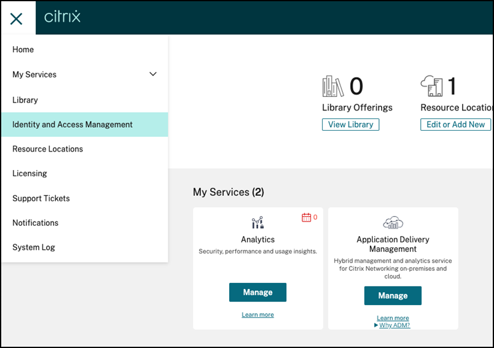
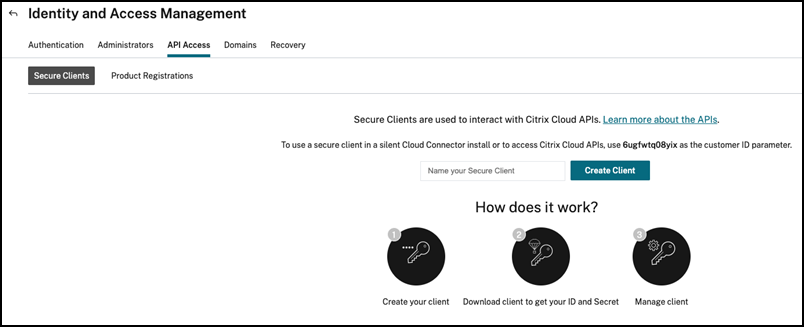
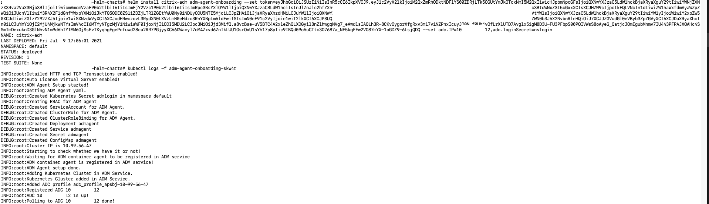

# Observability using NetScaler ADM for NetScaler deployed in dual tier topology

The aim of this example is to help visualising the request flow between different microservices using NetScaler ADM.

# Table of Contents

   [Prerequisites](#prerequisite)

  A. [Topology](#topology)

  B. [Deploying NetScaler ADM Agent](#onboarding)

  C. [Deploy Netflix application on Kubernetes Cluster ](#deploy-application)

  D. [NetScaler Cloud Native Dual Tier Topology ](#deploy-citrix-cloud-native-stack)

  E. [Send Traffic](#send-traffic)

  F. [Visualize Servicegraph in NetScaler ADM](#servicegraph)

  G. [Tracing](#trace)

  H. [Clean Up the deployment](#clean-up)

  I. [Debugging](#debugging)

# <a name="prerequisite">Prerequisites</a>
 - Ensure that you have a NetScaler ADM account. To use NetScaler ADM, you must create a [NetScaler Cloud account](https://docs.citrix.com/en-us/citrix-cloud/overview/signing-up-for-citrix-cloud/signing-up-for-citrix-cloud).

    To manage NetScaler ADM with an Express account, see [Getting Started](https://docs.citrix.com/en-us/citrix-application-delivery-management-service/getting-started.html#install-an-agent-as-a-microservice).

 - Ensure that you have installed Kubernetes version 1.16 or later. For information about Kubernetes, see  [Kubernetes](https://kubernetes.io/).
 - Ensure that you have NetScaler VPX version 13.0-76.31 or later.
 - For deploying NetScaler VPX or MPX as an Tier-1 ingress, you should establish the connectivity between NetScaler VPX or MPX and cluster nodes. This connectivity can be established by configuring routes on NetScaler as described in the [Static routing](https://github.com/netscaler/netscaler-k8s-ingress-controller/blob/master/docs/network/staticrouting.md) document or by deploying [NetScaler Node Controller](https://github.com/netscaler/netscaler-k8s-node-controller).
 - Ensure that hhe Helm with version 3.x is installed. For information, see [Helm installation](https://github.com/netscaler/netscaler-helm-charts/blob/master/Helm_Installation_version_3.md).
 - Ensure that the ports that described in the [Ports](https://docs.citrix.com/en-us/citrix-application-delivery-management-service/system-requirements.html#ports) document are open.


# <a name="topology">A) Topology</a>

Consider the Netflix application topology having NetScaler to deliver best user experience in North-South and East-West load balancing.

   

In this topology, two types of NetScalers have been deployed. One is VPX (non-container proxy) for routing the North-South traffic for microservices. In this topology, VPX is deployed as Tier 1 NetScaler. Second is NetScaler CPX (container proxy) for routing North-South Tier 1 traffic and East-West microservice traffic.

This deployment has its own advantages over service mesh deployment. The advantages include:

 - NetScaler Service Mesh lite topology eliminates the need of NetScaler CPX as sidecar proxy for each microservices.

 - One NetScaler CPX proxy can frontend more than one microservice application as shown in the preceding topology diagram.

Let us deploy the Netflix application in Service mesh lite deployment where:

 - Tier 1 NetScaler - VPX to ingress secure North-South traffic. You can have MPX/BLX as Tier 1 NetScaler also.

 - Tier 2 NetScaler - CPX to route North-South traffic from Tier 1 NetScaler to frontend Netflix microservice application

 - Tier 2 NetScaler - CPX to route East-West traffic from Netflix application.

# <a name="onboarding"> B) Onboarding of ADM agent</a>
You can deploy a NetScaler ADM agent as a microservice in the Kubernetes cluster to view service graph in NetScaler ADM. [ADM agent onboarding](../../adm-agent-onboarding) as a Kubernetes Job helps you to deploy container-based NetScaler ADM agent and also performs all the necessary settings in NetScaler ADM for generating service graph. This Job also registers the Tier-1 NetScaler in the NetScaler ADM.
To deploy ADM agent onboarding, you need to Kubernetes Secret with Access ID and Secret for accssing NetScaler ADM.

## **Get Access ID and Secret to access NetScaler ADM**</a> 

Perform the following steps to get access ID and secret for accessing NetScaler ADM:

1. Log in to NetScaler Cloud account. 

2. On the left Menu panel, select **Identity and Access Management**.

   

3. Go to **API Access**.

    

4. Specify the client name and click **Create Client**.

    

5. Download and save the `access-id` and `access-secret` generated.

    

 Now, you can generate `authorization bearer token` using access ID and access secret using below script: 

	wget  https://raw.githubusercontent.com/netscaler/netscaler-helm-charts/master/generate_token.py
    
	python3 generate_token.py --accessID=<accessID> --accessSecret=<accessSecret>

**NOTE**: The bearer token expires in an hour (3600 seconds).
	  
## Deploy ADM agent onboarding as Kubernetes Job
**NOTE** For deploying NetScaler VPX or MPX as an Tier-1 ingress, you should establish the connectivity between NetScaler VPX or MPX and cluster nodes. This connectivity can be established by configuring routes on NetScaler as described in the [Static routing](https://github.com/netscaler/netscaler-k8s-ingress-controller/blob/master/docs/network/staticrouting.md) document or by deploying [NetScaler Node Controller](https://github.com/netscaler/netscaler-k8s-node-controller).

To register Tier-1 NetScaler in NetScaler ADM with the agent getting deployed, you need to create Kubernetes Secret containing credentials of Tier-1 NetScaler VPX/MPX using the following command:

    kubectl create secret generic nslogin --from-literal=username=<username> --from-literal=password=<netscaler-password>

### To create ADM Agent login Secret automatically and register Tier-1 NetScaler , use the following command:

    helm repo add netscaler https://netscaler.github.io/netscaler-helm-charts

	helm install netscaler-adm netscaler/adm-agent-onboarding --set token=<Token> --set adc.IP=<NetScaler ManagementIP>,adc.loginSecret=nslogin

**Note:** If you are deploying NetScaler CPX and NetScaler ADM agent in different namespaces, please label namespace with `citrix-cpx=enabled` in which NetScaler CPX has been deployed.

You can check the logs of pod deployed as part of Kubernetes Job adm-agent-onboarding.



# <a name="deploy-application"> C) Deploy Netflix application on Kubernetes cluster </a>

Use the following command to deploy Netflix application on your Kubernetes cluster:

    kubectl create -f https://raw.githubusercontent.com/netscaler/netscaler-helm-charts/master/examples/servicegraph/manifest/netflix.yaml

# <a name="deploy-citrix-cloud-native-stack"> D) NetScaler Cloud Native Dual Tier Topology </a>

## To configure the Tier 1 NetScaler VPX using NetScaler Ingress Controller (NSIC):

The NetScaler appliance needs to have system user account (non-default) with certain privileges so that NetScaler ingress controller (NSIC) can configure the NetScaler VPX. For instructions to create the system user account on NetScaler, see [Create System User Account for NSIC in NetScaler](#create-system-user-account-for-cic-in-citrix-adc).

Create a Kubernetes secret for the user name and password using the following command:

    kubectl create secret generic nscred --from-literal=username='cic' --from-literal=password='<password>'

Download the consolidated YAML file which can deploy NetScaler ingress controller to configure Tier-1 NetScaler and Tier 2 CPX.

    wget https://raw.githubusercontent.com/netscaler/netscaler-helm-charts/master/examples/servicegraph/manifest/values.yaml

Update `cic.nsIP` with the NetScaler device/management IP address in `values.yaml`.

**Update**  `cic.analyticsConfig.endpoint.transactions.service` with the `NetScaler ADM service name with namespace as "namespace/service_name>" eg: default/adm-svc` in `values.yaml`.

## To configure the Tier-2 NetScaler CPX using NSIC:

NetScaler CPX is used to route North-South traffic from Tier 1 NetScaler to frontend Netflix microservice application and route East-West traffic from Netflix microservices. 

Use the following command to list the service IP address for NetScaler ADM Agent.

    kubectl get svc admagent -o wide 

Update the `cpx.analyticsConfig.endpoint.transactions.service` with the `NetScaler ADM service name with namespace as "namespace/service_name>" eg: default/adm-svc` and `ADMIP` with the `Cluster IP` of NetScaler ADM agent in `values.yaml`.

After updating the `values.yaml`, deploy NetScaler dual Tier deployment using the following commands:
  
    helm repo add netscaler https://netscaler.github.io/netscaler-helm-charts/
    helm install adc-netflix netscaler/citrix-cloud-native -f values.yaml 

## Create Ingress and Services for Netflix application

    wget https://raw.githubusercontent.com/netscaler/netscaler-helm-charts/master/examples/servicegraph/manifest/vpx_ingress.yaml

  **Update**  `ingress.citrix.com/frontend-ip` in `vpx_ingress.yaml` with the virtual IP address with which you want to expose Netflix application.

    kubectl apply -f vpx_ingress.yaml
    kubectl create -f https://raw.githubusercontent.com/netscaler/netscaler-helm-charts/master/examples/servicegraph/manifest/cpx_ingress.yaml
    kubectl create -f https://raw.githubusercontent.com/netscaler/netscaler-helm-charts/master/examples/servicegraph/manifest/smlite_services.yaml

# <a name="send-traffic"> E) Send Traffic </a>

Send traffic using helper script:

    wget https://raw.githubusercontent.com/citrix/cloud-native-getting-started/master/servicegraph/manifest/traffic.sh

Provide VIP which has been used to expose the Netflix application in `traffic.sh` and start traffic.

    nohup sh traffic.sh <VIP> > log &

# <a name="servicegraph"> F) Visualize Service Graph in NetScaler ADM</a>

Before visualizing the Service Graph, you can check if the vservers configured in NetScaler are properly discovered and licensed. For this, check the section [debugging](#debugging).

In ADM, navigate  `Application > Service Graph > MicroServices` .

  


  

You can view **transation logs** as well in the servicegraph.

  

# <a name="trace">G) Tracing </a>

A user can select **See Trace Details** to visualize the entire trace in the form of a chart of all transactions which are part of the trace.

  

# <a name="clean-up">H) Clean up the deployment </a>

    kubectl delete -f https://raw.githubusercontent.com/netscaler/netscaler-helm-charts/master/examples/servicegraph/manifest/cpx_ingress.yaml
    kubectl delete -f https://raw.githubusercontent.com/netscaler/netscaler-helm-charts/master/examples/servicegraph/manifest/smlite_services.yaml
    kubectl delete -f https://raw.githubusercontent.com/netscaler/netscaler-helm-charts/master/examples/servicegraph/manifest/netflix.yaml
    kubectl delete -f vpx_ingress.yaml
    helm uninstall adc-netflix
    helm uninstall netscaler-adm
    kubectl delete deployment admagent
	kubectl delete secret admagent
	kubectl delete configmaps admagent
	kubectl delete svc admagent
	kubectl delete secret admlogin
    kubectl delete secret nslogin
    kubectl delete sa admagent
    kubectl delete clusterroles admagent
    kubectl delete clusterrolebindings admagent

**Note:** You need to remove the Cluster and Agent from NetScaler ADM UI manually.

# <a name="debugging">I) Debugging </a>

Service Graph will not be populated if vserver configuration of Tier 2 NetScaler are not populated in ADM. Also, the vserver in Tier-1 NetScaler need to be licensed. Following sections guide on licensing vserver in Tier-1 NetScaler VPX and discovering the vserver configuration on Tier 2 NetScaler CPX.

## Licensing vserver of Tier-1 NetScaler VPX

1. Navigate to `Networks > Instances > NetScaler` and choose `VPX` in NetScaler ADM.

2. Select the `VPX IP` of your Tier-1 NetScaler and choose `Configure Analytics` under `Select Action`.

   

3. Vserver configured on the VPX is displayed.

4. License the vserver with name `netflix-<VIP IP>_80_http`, if it is not licensed. To license, select the `vserver` and click `License`.

   

   


## Disovering Vserver Configuration of Tier-2 NetScaler CPX

1. Navigate to `Networks > Instances > NetScaler` and choose `CPX` instance with the name prefix with `adc-netflix-cpx` in NetScaler ADM.

2. Select the `CPX` from the list and choose `Configure Analytics` under `Select Action`.

   

3. NetScaler ADM polls the CPX in the interval of 10 mins. If the page does not list vserver, then you can manually poll the CPX.

   

4. For manual polling CPX:

    a. Navigate to `Networks > Networking Functions` and click `Poll Now`.
   
    

    b. Click `Select Instances`. You will get list of instances. 
   
    

    c. Choose the `CPX` instance from the list.

    

    d. Click `Start Polling`.
    
    

    e. Polling takes a couple of minutes to complete.

    

     Once polling is completed, navigate to `Networks > Instances > NetScaler` and choose `CPX` instance with the name prefix with `adc-netflix-cpx` in NetScaler ADM. 
     
     Select the `CPX` from the list and choose `Configure Analytics` under `Select Action`. 
     
     Now you will get the list of Vservers configured on CPX.

    

    You can now view the servicegraph by navigating to `Applications > Service Graph > Microservices ` in NetScaler ADM.

# <a name="create-system-user-account-for-cic-in-citrix-adc"> Create system user account for NetScaler ingress controller in NetScaler</a>

NetScaler ingress controller configures the NetScaler using a system user account of the NetScaler. The system user account should have certain privileges so that the NSIC has permission to configure the following on the NetScaler:

 - Add, Delete, or View Content Switching (CS) virtual server
 - Configure CS policies and actions
 - Configure Load Balancing (LB) virtual server
 - Configure Service groups
 - Cofigure SSL certkeys
 - Configure routes
 - Configure user monitors
 - Add system file (for uploading SSL certkeys from Kubernetes)
 - Configure Virtual IP address (VIP)
 - Check the status of the NetScaler appliance

**Note:**
> The system user account would have privileges based on the command policy that you define.

To create the system user account, perform the following:

 1. Log on to the NetScaler appliance.
 2. Use an SSH client, such as PuTTy, to open an SSH connection to the NetScaler appliance.
 3. Log on to the appliance by using the administrator credentials.
 4. Create the system user account using the following command:

        add system user <username> <password>

 For example:

    add system user cic mypassword

 5. Create a policy to provide required permissions to the system user account. Use the following command:

    ```
      add cmdpolicy cic-policy ALLOW '^(\?!shell)(\?!sftp)(\?!scp)(\?!batch)(\?!source)(\?!.*superuser)(\?!.*nsroot)(\?!install)(\?!show\s+system\s+(user|cmdPolicy|file))(\?!(set|add|rm|create|export|kill)\s+system)(\?!(unbind|bind)\s+system\s+(user|group))(\?!diff\s+ns\s+config)(\?!(set|unset|add|rm|bind|unbind|switch)\s+ns\s+partition).*|(^install\s*(wi|wf))|(^\S+\s+system\s+file)^(\?!shell)(\?!sftp)(\?!scp)(\?!batch)(\?!source)(\?!.*superuser)(\?!.*nsroot)(\?!install)(\?!show\s+system\s+(user|cmdPolicy|file))(\?!(set|add|rm|create|export|kill)\s+system)(\?!(unbind|bind)\s+system\s+(user|group))(\?!diff\s+ns\s+config)(\?!(set|unset|add|rm|bind|unbind|switch)\s+ns\s+partition).*|(^install\s*(wi|wf))|(^\S+\s+system\s+file)'
    ```

    **Note**: The system user account would have privileges based on the command policy that you define.
    The command policy mentioned in ***step 5*** is similar to the built-in `sysAdmin` command policy with another permission to upload files.

    The command policy spec provided above have already escaped special characters for easier copy pasting into the NetScaler command line.

    For configuring the command policy from NetScaler Configuration Wizard (GUI), use the below command policy spec.

    ```
      ^(?!shell)(?!sftp)(?!scp)(?!batch)(?!source)(?!.*superuser)(?!.*nsroot)(?!install)(?!show\s+system\s+(user|cmdPolicy|file))(?!(set|add|rm|create|export|kill)\s+system)(?!(unbind|bind)\s+system\s+(user|group))(?!diff\s+ns\s+config)(?!(set|unset|add|rm|bind|unbind|switch)\s+ns\s+partition).*|(^install\s*(wi|wf))|(^\S+\s+system\s+file)^(?!shell)(?!sftp)(?!scp)(?!batch)(?!source)(?!.*superuser)(?!.*nsroot)(?!install)(?!show\s+system\s+(user|cmdPolicy|file))(?!(set|add|rm|create|export|kill)\s+system)(?!(unbind|bind)\s+system\s+(user|group))(?!diff\s+ns\s+config)(?!(set|unset|add|rm|bind|unbind|switch)\s+ns\s+partition).*|(^install\s*(wi|wf))|(^\S+\s+system\s+file)
    ```

 6. Bind the policy to the system user account using the following command:

        bind system user cic cic-policy 0
