# Observability using NetScaler ADM and NetScaler Observability Exporter in NetScaler powered Service mesh

This guide provides a comprehensive example for:

i) Deploying the sample [Bookinfo](https://github.com/istio/istio/tree/master/samples/bookinfo) and [Httpbin](https://github.com/istio/istio/blob/master/samples/httpbin/httpbin.yaml) applications with NetScaler as North-South and East-West proxies in Istio service mesh.

ii) Using NetScaler ADM service graph and NetScaler Observability Exporter as observability tools.

The objective of this example is to help in visualizing the request flow between different microservices using NetScaler ADM and metrics on the Grafana dashboard through NetScaler Observability Exporter.

# Table of Contents

   [Prerequisites](#prerequisite)

   A. [Onboarding of ADM agent](#onboarding)

   B. [Deploying NetScaler Observability Exporter](#deploying-coe)

   C. [Generating Certificate and Key for Bookinfo and Httpbin applications](#generating-certificate)

   D. [Deploying NetScaler as Ingress Gateway](#citrix-ingress-gateway)

   E. [Deploying NetScaler Sidecar Injector](#citrix-sidecar-injector)

   F. [Deploying Bookinfo and Httpbin](#deploying-bookinfo-httpbin)

   G. [Generate application traffic](#send-traffic)

   H. [Deploy Gateway for Prometheus and Grafana](#deploy-gateway-prom-grafana)

   I. [Visualize Service Graph in NetScaler ADM](#servicegraph)

   J. [Clean Up the deployment](#cleanup)

   K. [Debugging](#debugging)

# <a name="prerequisite">Prerequisites</a>
 - Ensure that you have a NetScaler ADM account. To use NetScaler ADM, you must create a [NetScaler Cloud account](https://docs.citrix.com/en-us/citrix-cloud/overview/signing-up-for-citrix-cloud/signing-up-for-citrix-cloud).

    To manage NetScaler ADM with an Express account, see [Getting Started](https://docs.citrix.com/en-us/citrix-application-delivery-management-service/getting-started.html#install-an-agent-as-a-microservice).

 - Ensure that your cluster [Kubernetes](https://kubernetes.io/) version should be 1.16 onwards.
 - Ensure that you have NetScaler VPX version 13.0–76.29 or later.
 - For deploying NetScaler VPX or MPX as an ingress gateway, you should establish the connectivity between NetScaler VPX or MPX and cluster nodes. This connectivity can be established by configuring routes on NetScaler as described in the [Static routing](https://github.com/netscaler/netscaler-k8s-ingress-controller/blob/master/docs/network/staticrouting.md) or by deploying [NetScaler Node Controller](https://github.com/netscaler/netscaler-k8s-node-controller).
 - Ensure that you installed [Istio](https://istio.io) version 1.9.x or later on the Kubernetes cluster with [Prometheus](https://prometheus.io) and [Grafana](https://grafana.com). For information about installing Prometheus, see [Installation Quick Start](https://istio.io/latest/docs/ops/integrations/prometheus/#option-1-quick-start) and for Grafana, see [Quick Start](https://istio.io/latest/docs/ops/integrations/grafana/#option-1-quick-start).
 - Ensure that the ports, mentioned in the [Ports](https://docs.citrix.com/en-us/citrix-application-delivery-management-service/system-requirements.html#ports) document, are open.

# <a name="Topology">Topology</a>

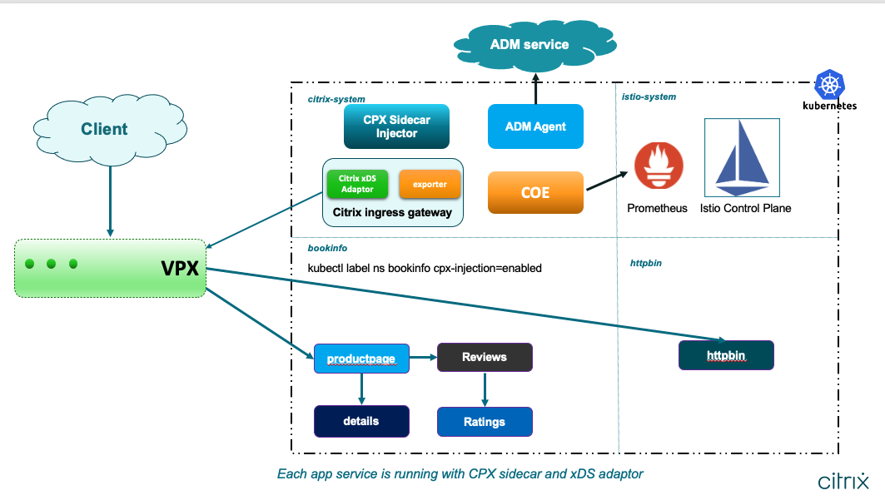

# <a name="onboarding">A) Onboarding of ADM agent </a>

You can deploy a NetScaler ADM agent as a microservice in the Kubernetes cluster to view service graph in NetScaler ADM. [ADM agent onboarding](../../adm-agent-onboarding) as a Kubernetes Job helps you to deploy container-based NetScaler ADM agent and also performs all the necessary settings in NetScaler ADM for generating service graph. This Job also registers the Tier-1 NetScaler in the NetScaler ADM.
To deploy ADM agent onboarding, you need to Kubernetes Secret with Access ID and Secret for accssing NetScaler ADM.

## **Get Access ID and Secret to access NetScaler ADM**</a> 

Perform the following steps to get access ID and secret for accessing NetScaler ADM:

1. Log in to NetScaler Cloud account. 

2. On the left Menu panel, select **Identity and Access Management**.

   

3. Go to **API Access**.

    

4. Specify the client name and click **Create Client**.

    

5. Download and save the `access-id` and `access-secret` generated.

    

 Now, you can generate `authorization bearer token` using access ID and access secret using below script: 

	wget  https://raw.githubusercontent.com/citrix/citrix-helm-charts/master/generate_token.py
      
	python3 generate_token.py --accessID=<accessID> --accessSecret=<accessSecret>

**NOTE**: The bearer token expires in an hour (3600 seconds).
	  
## Deploy ADM agent onboarding as Kubernetes Job
**NOTE** For deploying NetScaler VPX or MPX as an Tier-1 ingress, you should establish the connectivity between NetScaler VPX or MPX and cluster nodes. This connectivity can be established by configuring routes on NetScaler as described [here](https://github.com/netscaler/netscaler-k8s-ingress-controller/blob/master/docs/network/staticrouting.md) or by deploying [NetScaler Node Controller](https://github.com/netscaler/netscaler-k8s-node-controller).

To register Tier-1 NetScaler in NetScaler ADM with the agent getting deployed, you need to create Kubernetes Secret containing credentials of Tier-1 NetScaler VPX/MPX using following command:

      kubectl create secret generic nslogin --from-literal=username=<username> --from-literal=password=<netscaler-password>

### To create ADM Agent login Secret automatically and register Tier-1 NetScaler , use the following command:

      helm repo add netscaler https://netscaler.github.io/netscaler-helm-charts

      helm install netscaler-adm netscaler/adm-agent-onboarding --namespace netscaler-system --set adc.IP=<NetScaler ManagementIP>,adc.loginSecret=nslogin --set token=<Token>

You can check the logs of pod deployed as part of Kubernetes Job adm-agent-onboarding.

**Note:** You can label the namespace with `cpx-injection=enabled` in which NetScaler CPX.

  To auto register NetScaler CPX in ADM for obtaining [servicegraph](https://docs.netscaler.com/en-us/citrix-application-delivery-management-service/application-analytics-and-management/service-graph.html), a Kubernetes secret `admlogin` will be automatically created when namespace are labelled with `cpx-injection=enabled`. 

      kubectl create namespace bookinfo

      kubectl create namespace netscaler-system

      kubectl create namespace httpbin

      kubectl label namespace bookinfo cpx-injection=enabled

      kubectl label namespace httpbin cpx-injection=enabled

# <a name="deploying-coe">B) Deploying NetScaler Observability Exporter</a>

NetScaler Observability Exporter helps in exporting metrics from NetScaler instances to Prometheus which can be visualized in the Grafana dashboard.

      helm repo add netscaler https://netscaler.github.io/netscaler-helm-charts/
   
      helm install coe netscaler/netscaler-observability-exporter --namespace netscaler-system --set timeseries.enabled=true

Apply destination rule to disable TLS communication of NetScaler with NetScaler Observability Exporter and ADM by following command:

      kubectl apply -f https://raw.githubusercontent.com/citrix/citrix-helm-charts/master/examples/servicemesh_with_coe_and_adm/manifest/destinationrule_agent_coe.yaml -n netscaler-system

**NOTE:** Create gateway for NetScaler observability exporter when NetScaler CPX is used as ingress gateway.

      kubectl apply -f https://raw.githubusercontent.com/citrix/citrix-helm-charts/master/examples/servicemesh_with_coe_and_adm/manifest/coe_gateway.yaml -n netscaler-system      

# <a name="generating-certificate">C) Generating Certificate and Key for the `Bookinfo` and `Httpbin` applications</a>

### C.1) Generate certificate and key for the `Bookinfo` application

There are multiple tools available to generate certificates and keys. You can use your desired tool to generate the same in PEM format. Make sure that the names of key and certificate are *bookinfo_key.pem* and *bookinfo_cert.pem*. These are used to generate a Kubernetes secret *citrix-ingressgateway-certs* which is used by the NetScaler that acts as Ingress Gateway.

Perform the following steps to generate certificate and key using `openssl` utility:

#### C.1.1) Generate private key for the `Bookinfo` application

      openssl genrsa -out bookinfo_key.pem 2048

#### C.1.2) Generate Certificate Signing Request for the `Bookinfo` application

Make sure to provide Common Name(CN/Server FQDN) as `www.bookinfo.com` on CSR information prompt.

      openssl req -new -key bookinfo_key.pem -out bookinfo_csr.pem

#### C.1.3) Generate Self-Signed Certificate for the `Bookinfo` application

      openssl x509 -req -in bookinfo_csr.pem -sha256 -days 365 -extensions v3_ca -signkey bookinfo_key.pem -CAcreateserial -out bookinfo_cert.pem

#### C.1.4) Create a Kubernetes secret for certificate of `Bookinfo` application

Create a secret `citrix-ingressgateway-certs` using the certificate and key generated in the earlier step. Make sure that this secret is created in the same namespace where the Ingress Gateway is deployed.

      kubectl create -n netscaler-system secret tls citrix-ingressgateway-certs --key bookinfo_key.pem --cert bookinfo_cert.pem

### C.2) Generate certificate and key for `httpbin` application
 
 You can use your desired tool to generate the same in PEM format. Make sure names of key and certificate are *httpbin_key.pem* and *httpbin_cert.pem*. These are used to generate a Kubernetes secret *httpbin-ingressgateway-certs* which is used by the NetScaler taht acts as Ingress Gateway.

Perform the following steps to generate certificate and key using `openssl` utility:

#### C.2.1) Generate Private Key for the `httpbin` application

      openssl genrsa -out httpbin_key.pem 2048

#### C.2.2) Generate Certificate Signing Request for the `httpbin` application

Make sure to provide Common Name(CN/Server FQDN) as `www.httpbin.com` on CSR information prompt.

      openssl req -new -key httpbin_key.pem -out httpbin_csr.pem

#### C.2.3) Generate Self-Signed Certificate for the `httpbin` application

      openssl x509 -req -in httpbin_csr.pem -sha256 -days 365 -extensions v3_ca -signkey httpbin_key.pem -CAcreateserial -out httpbin_cert.pem

#### C.2.4) Create a Kubernetes secret for certificate of the `httpbin` application

Create a secret `httpbin-ingressgateway-certs` using the certificate and key generated in the earlier step. Make sure that this secret is created in the same namespace in which the Ingress Gateway is deployed.

      kubectl create -n netscaler-system secret tls httpbin-ingressgateway-certs --key httpbin_key.pem --cert httpbin_cert.pem

# <a name="citrix-ingress-gateway">D) Deploying NetScaler as Ingress Gateway</a>

Before deploying NetScaler VPX as Ingress Gateway, get the pod IP address of the NetScaler ADM Agent using the following command:

      kubectl get endpoints admagent

This ADM Agent pod IP address is required for some manual config on the VPX Ingress Gateway.

### Deploy VPX/MPX as Ingress Gateway

You can deploy NetScaler CPX or VPX/MPX, as an ingress gateway using helm charts. The sample `bookinfo` deployment works in both of the deployments. 

- **Important Note:** For deploying NetScaler VPX or MPX as ingress gateway, you should establish the connectivity between NetScaler VPX or MPX and cluster nodes. This connectivity can be established by configuring routes on NetScaler as mentioned in the [Static Routing](https://github.com/netscaler/netscaler-k8s-ingress-controller/blob/master/docs/network/staticrouting.md) document or by deploying [NetScaler Node Controller](https://github.com/netscaler/netscaler-k8s-node-controller).

Create a Kubernetes secret `nslogin` with the login credentials of NetScaler VPX/MPX using the following command:
   
      kubectl create secret generic nslogin --from-literal=username=<username> --from-literal=password=<password> -n netscaler-system

**Note:** Replace `<username>` and `<password>` with login credentials of NetScaler VPX/MPX.

#### Deploying NetScaler VPX/MPX as Ingress Gateway using Helm Chart

      helm repo add netscaler https://netscaler.github.io/netscaler-helm-charts/
   
      helm install citrix-adc-istio-ingress-gateway netscaler/citrix-adc-istio-ingress-gateway --namespace netscaler-system --set ingressGateway.EULA=YES  --set secretName=nslogin --set coe.coeURL=coe.netscaler-system --set ingressGateway.secretVolumes[0].name=httpbin-ingressgateway-certs,ingressGateway.secretVolumes[0].secretName=httpbin-ingressgateway-certs,ingressGateway.secretVolumes[0].mountPath=/etc/istio/httpbin-ingressgateway-certs --set ingressGateway.enableLabelsFeature=TRUE --set ingressGateway.netscalerUrl=https://<Management IP> --set ingressGateway.vserverIP=<Virtual Service IP>

**Note:** Replace management IP address with NetScaler VPX/MPX management IP address, Virtual Service IP address as IP address to which `Bookinfo` and `Httpbin` applications are exposed.

**Note:** If NetScaler CPX is deployed as Ingress Gateway and `adm-agent-onboarding` job is deployed in other namespace than `netscaler-system`, then label the namespace `netscaler-system` with `citrix-cpx=enabled`.

      kubectl label namespace netscaler-system citrix-cpx=enabled

#### Set Analytics Settings on NetScaler VPX/MPX

Following configurations must be added in NetScaler VPX/MPX for sending transaction metrics to NetScaler ADM.

      en ns mode ulfd
      
      en ns feature appflow
      
      add appflow collector logproxy_lstreamd -IPAddress <ADM-AGENT-POD-IP> -port 5557 -Transport logstream

      set appflow param -templateRefresh 3600 -httpUrl ENABLED -httpCookie ENABLED -httpReferer ENABLED -httpMethod ENABLED -httpHost ENABLED -httpUserAgent ENABLED -httpContentType ENABLED -httpAuthorization ENABLED -httpVia ENABLED -httpXForwardedFor ENABLED -httpLocation ENABLED -httpSetCookie ENABLED -httpSetCookie2 ENABLED -httpDomain ENABLED -httpQueryWithUrl ENABLED  metrics ENABLED -events ENABLED -auditlogs ENABLED
      
      add appflow action logproxy_lstreamd -collectors logproxy_lstreamd
      
      add appflow policy logproxy_policy true logproxy_lstreamd
      
      bind appflow global logproxy_policy 10 END -type REQ_DEFAULT 
      
      bind appflow global logproxy_policy 10 END -type OTHERTCP_REQ_DEFAULT

**Note:** Replace the `AGENT POD IP` while adding `appflow collector`. 

# <a name="citrix-sidecar-injector">E) Deploying NetScaler Sidecar Injector </a>

Deploy a NetScaler CPX sidecar injector to inject NetScaler CPX as a sidecar proxy in an application pod in the Istio service mesh by using the following command:

      helm repo add netscaler https://netscaler.github.io/netscaler-helm-charts/

      helm install cpx-sidecar-injector netscaler/citrix-cpx-istio-sidecar-injector --namespace netscaler-system --set cpxProxy.EULA=YES --set coe.coeURL=coe.netscaler-system --set cpxProxy.enableLabelsFeature=TRUE --set ADMSettings.ADMIP=<ADM-AGENT-SERVICE-IP>  

# <a name="deploying-bookinfo-httpbin">F) Deploying `Bookinfo` and `Httpbin`</a> 

In this example, the `bookinfo` and `httpbin` applications are deployed and exposed to the cluster-external world using the Istio Gateway resource. 
 
### G.1) Enable Namespace for Sidecar Injection
When a namespace is labelled with `cpx-injection=enabled`, CPX as sidecar proxy will be deployed along with application. As part of step A, both `bookinfo` and `httpbin` namespace are  labelled with `cpx-injection=enabled`. 

### F.2) Deploy the `Bookinfo` Application

      kubectl apply -n bookinfo -f https://raw.githubusercontent.com/citrix/citrix-helm-charts/master/examples/servicemesh_with_coe_and_adm/manifest/bookinfo.yaml  

### F.3) Deploy the `Httpbin` Application

      kubectl apply -n httpbin -f https://raw.githubusercontent.com/citrix/citrix-helm-charts/master/examples/servicemesh_with_coe_and_adm/manifest/httpbin.yaml

### F.4) Configure Ingress Gateway for `Bookinfo` and `Httpbin`

      kubectl apply -n bookinfo -f https://raw.githubusercontent.com/citrix/citrix-helm-charts/master/examples/citrix-adc-in-istio/bookinfo/deployment-yaml/bookinfo_https_gateway.yaml

      kubectl apply -n bookinfo -f https://raw.githubusercontent.com/citrix/citrix-helm-charts/master/examples/citrix-adc-in-istio/bookinfo/deployment-yaml/bookinfo_http_gateway.yaml

      kubectl apply -n httpbin -f https://raw.githubusercontent.com/citrix/citrix-helm-charts/master/examples/servicemesh_with_coe_and_adm/manifest/httpbin_secure_gateway.yaml
                                  
### F.5) Configure Virtual Service for `productpage` service for `bookinfo`

      kubectl apply -n bookinfo -f https://raw.githubusercontent.com/citrix/citrix-helm-charts/master/examples/citrix-adc-in-istio/bookinfo/deployment-yaml/productpage_vs.yaml

# <a name="send-traffic"> G) Generate application traffic</a>
   
  Send traffic using the helper script

      wget https://raw.githubusercontent.com/citrix/citrix-helm-charts/master/examples/servicemesh_with_coe_and_adm/manifest/traffic.sh

Provide VIP which has been used to expose the `bookinfo` and `httpbin` applications in `traffic.sh` and start traffic.

      nohup sh traffic.sh <VIP> > log &

To access from the browser, add the following entries on `/etc/hosts/`:
   
      VIP www.bookinfo.com
      
      VIP www.httpbin.com

Use the following instructions if you are running Linux/Unix/Mac:

1. Open a Terminal window.

2. Enter the following command to open the hosts file in a text editor:

      `sudo nano /etc/hosts`

3. Enter your domain user password.

4. Add below entries on the file
      
      `VIP www.bookinfo.com`

      `VIP www.httpbin.com`

5. Press **Control-X** keys.

6. When you are asked if you want to save your changes, enter **y**.

Use the following instructions if you are running Windows 10 or Windows 8:

1. Press the **Windows** key.

2. Type `Notepad` in the search field.

3. In the search results, right-click `Notepad` and select **Run as administrator**.

4. From Notepad, open the following file:
      
      `c:\Windows\System32\Drivers\etc\hosts`

7. Add the following entries on the file:

      `VIP www.bookinfo.com`
      
      `VIP www.httpbin.com`

8. **Select File > Save** to save your changes.
      
Now, access the `bookinfo` application using `www.bookinfo.com/productpage` and `httpbin` as `www.httpbin.com`

# <a name="deploy-gateway-prom-grafana">H) Deploy Gateway for Prometheus and Grafana</a>

**NOTE**: Prometheus and Grafana should be installed along with Istio.

Expose Prometheus and Grafana using gateway CRD through VPX.

      kubectl apply -f https://raw.githubusercontent.com/citrix/citrix-helm-charts/master/examples/servicemesh_with_coe_and_adm/manifest/prometheus_gateway.yaml
      kubectl apply -f https://raw.githubusercontent.com/citrix/citrix-helm-charts/master/examples/servicemesh_with_coe_and_adm/manifest/grafana_gateway.yaml

Add entries in `/etc/hosts` for Prometheus and Grafana.

      VIP grafana.citrixservicemesh.com
      VIP prometheus.citrixservicemesh.com

With the browser, you can access Prometheus and Grafana using the following URLs:
     
      http://prometheus.citrixservicemesh.com:9090/graph
      http://grafana.citrixservicemesh.com:3000

## Verify NetScaler Observability Exporter as endpoints to Prometheus

1. Open **http://prometheus.citrixservicemesh.com:9090/graph** with a browser.

2. Click **Status > Targets** and scroll down. Under `kubernetes-pods`, you can see the NetScaler Observability Exporter pod IP address as one of the entries.

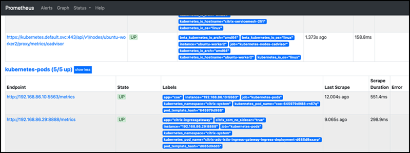

To get pod IP address of NetScaler Observability Exporter deployed in `netscaler-system`, run the command `kubectl get pods -o wide -n netscaler-system` in the Kubernetes cluster.

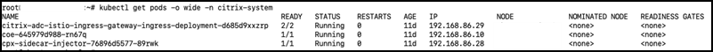

## Configuring the Dashboard in Grafana

1. Open **http://grafana.citrixservicemesh.com:3000** in browser.

2. On Grafana, click **Configuration**. 

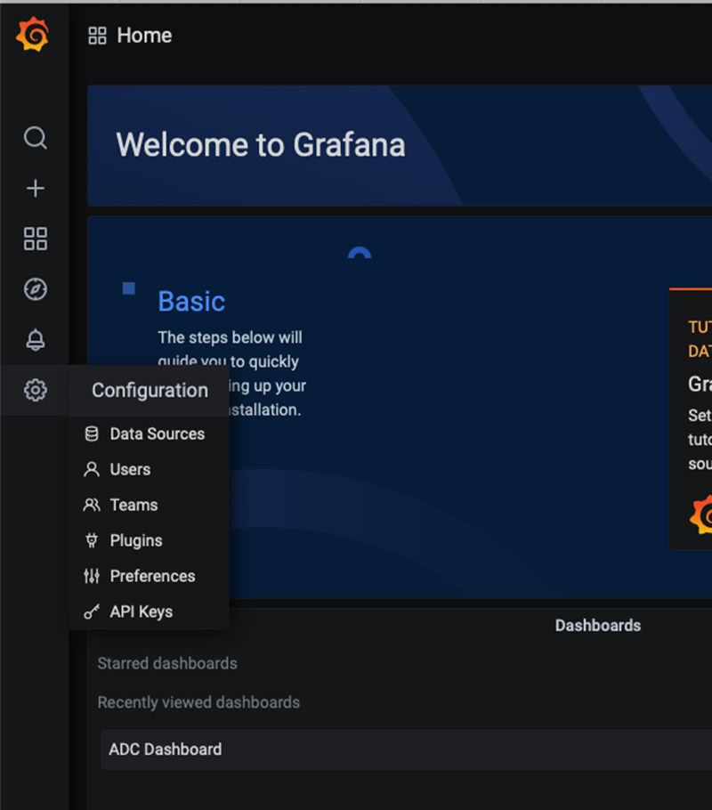

3. Click **Prometheus**.

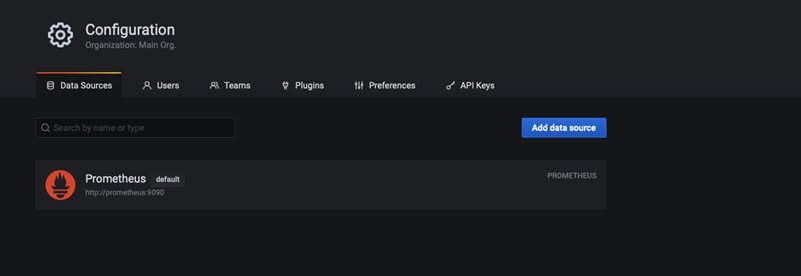

4. Modify the name as `Prometheus` and click **Save and Test**.

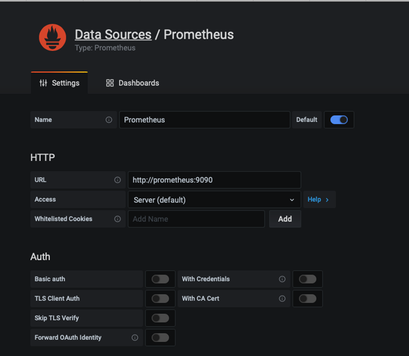

5. Open **[this](https://raw.githubusercontent.com/citrix/citrix-helm-charts/master/examples/servicemesh_with_coe_and_adm/manifest/dashboard.json)** in another tab and copy the JSON content.

6. Click **+** and select **Import**. 

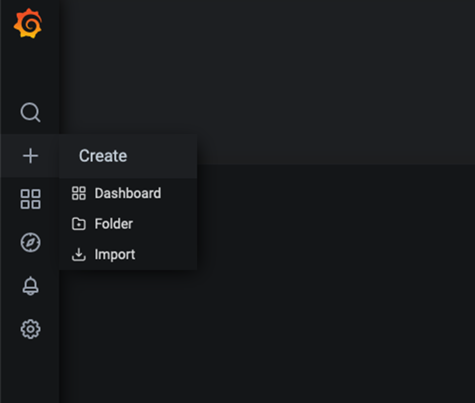

Paste the copied JSON content and click **Load**. 

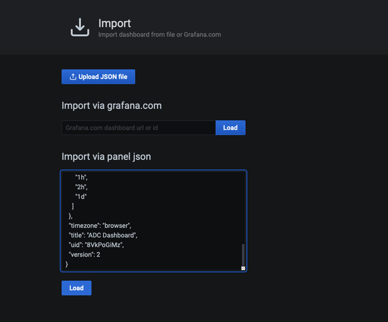

7. You can set a proper name for Dashboard and click **Import**.

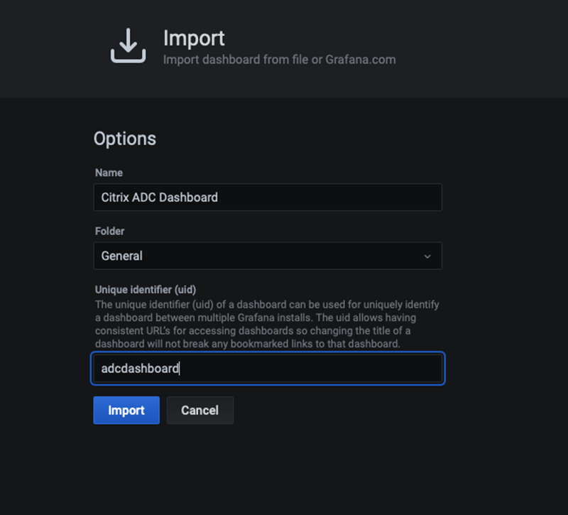

8. NetScaler dashboard displays the stats of the Ingress Gateway and NetScaler CPX sidecar proxies.

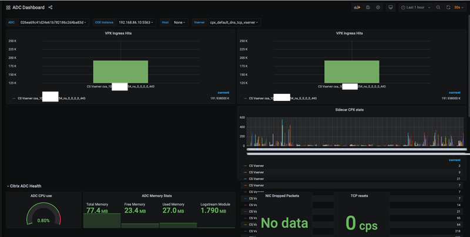

# <a name="servicegraph"> I) Visualize Service Graph in NetScaler ADM</a>

Before visualizing the Service Graph, you can check if the virtual server configured in NetScaler are properly discovered and licensed. For this, see the section: [Debugging](#debugging).

In ADM navigate  `Application > Service Graph > MicroServices`.

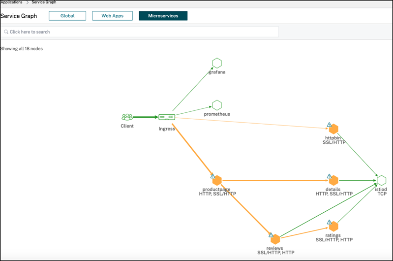

You can view **transation logs** in the service graph. Click any service and select **Transaction Logs**. 

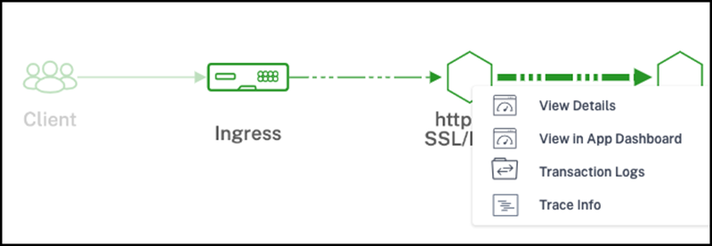

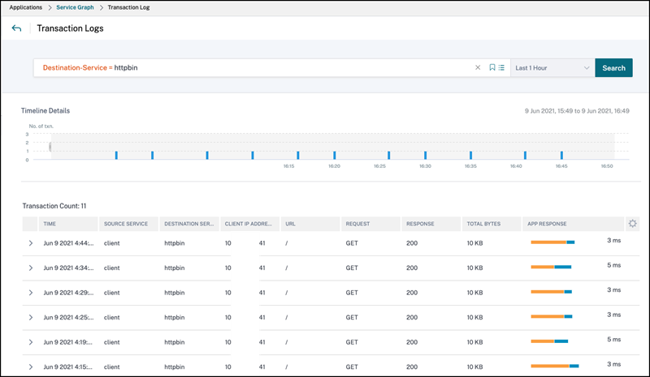

### Tracing

You can view **Tracing** from the service graph. Click any service and select **Trace Info**.

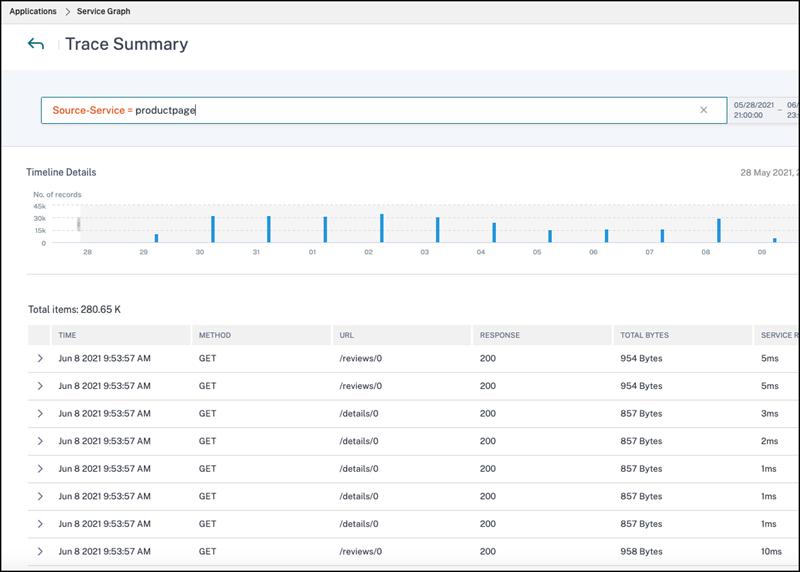

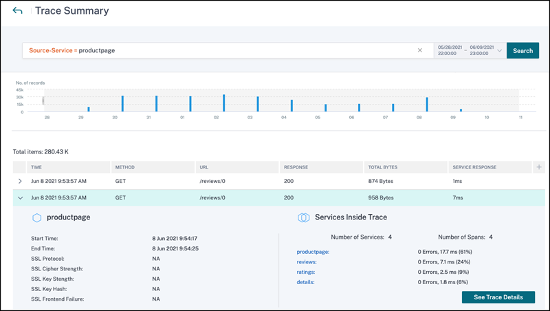

You can select **See Trace Details** to visualize the entire trace in the form of a chart of all transactions which are part of the trace.

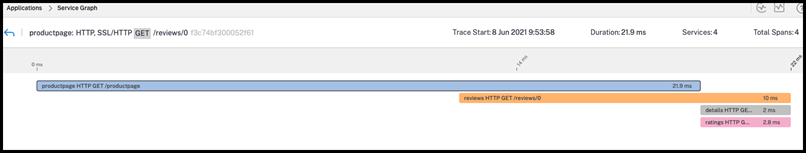

# <a name="cleanup">J) Clean Up </a>

      kubectl delete namespace bookinfo
      kubectl delete namespace httpbin 
      kubectl delete namespace netscaler-system
      kubectl delete -f destinationrule_agent_coe.yaml

**Note:** You need to remove the cluster and agent from NetScaler ADM UI manually.

# <a name="debugging">K) Debugging </a>

Service Graph will not be populated if virtual server configurations of NetScaler CPXs are not populated in ADM. Also, the virtual server in the ingress gateway NetScaler need to be licensed. Following sections provide information on licensing the virtual server in the ingress gateway NetScaler VPX and discovering the virtual server configuration on NetScaler CPX.

## Licensing virtual server of Ingress Gateway NetScaler VPX

1. Navigate to `Networks > Instances > NetScaler` and choose `VPX` in NetScaler ADM.

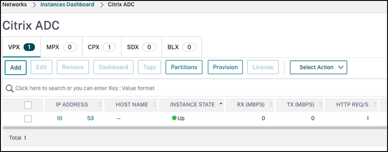

2. Select the `VPX IP` of your ingress gateway NetScaler and choose `Configure Analytics` under `Select Action`.

3. Virtual server configured on the VPX is listed.

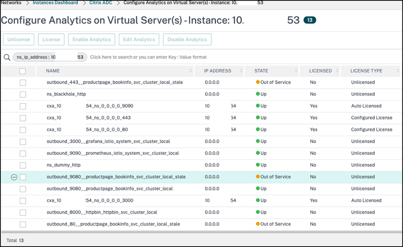

4. License all the virtual server whose IP address is VIP, if it is not licensed. To license, select the `vserver` and click `License`.

#### Discovering virtual server Configuration of NetScaler CPX

1. Navigate to `Networks > Instances > NetScaler` and choose a NetScaler CPX instance.

2. Select the NetScaler CPX instance from the list and choose `Configure Analytics` under `Select Action`.

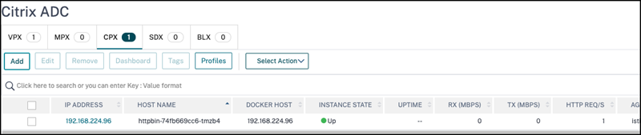
   
3. NetScaler ADM polls the NetScaler CPX in the interval of 10 mins. If the page does not list virtual server, then you can manually poll the NetScaler CPX.

   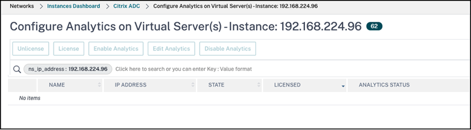

4. For manual Polling NetScaler CPX:

    a. Navigate to `Networks > Networking Functions` and click `Poll Now`.
   
    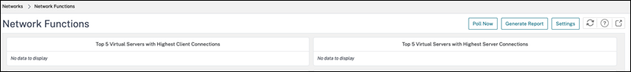

    b. Click `Select Instances`. A list of instances is displayed. 

    c. Choose the NetScaler CPX instance from the list.

    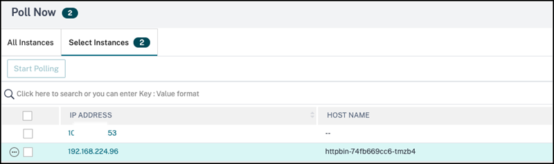

    d. Click `Start Polling`
    
    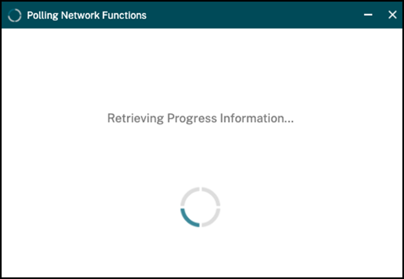

    e. Polling requires a couple of minutes to complete.

    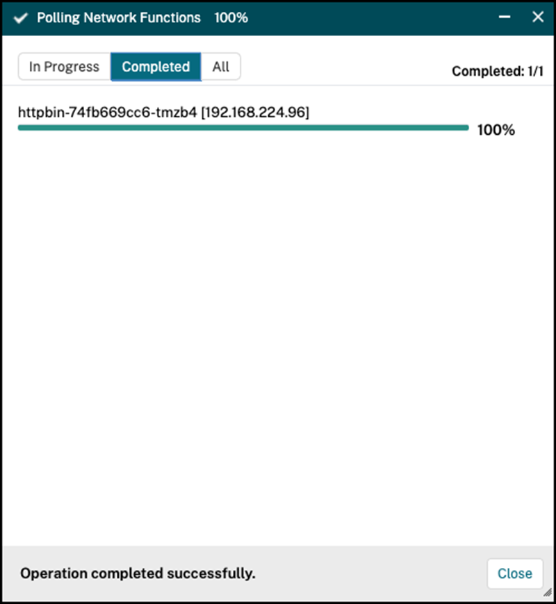

     Once polling is completed, navigate to `Networks > Instances > NetScaler` and choose NetScaler CPX instance. 
     
     Select the NetScaler CPX from the list and choose `Configure Analytics` under `Select Action`. 
     
     Now, the list of virtual server configured on NetScaler CPX is displayed.

    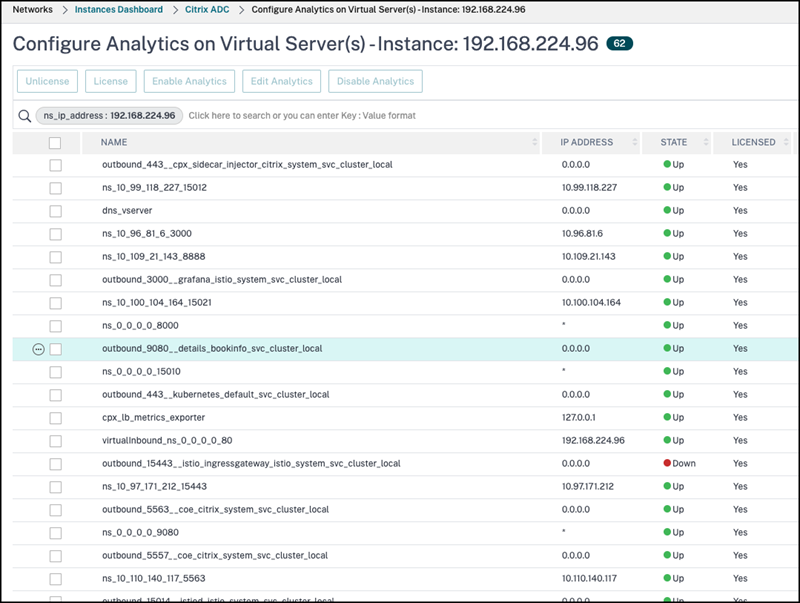

    You can now view the service graph by navigating to `Applications > Service Graph > Microservices ` in NetScaler ADM.
